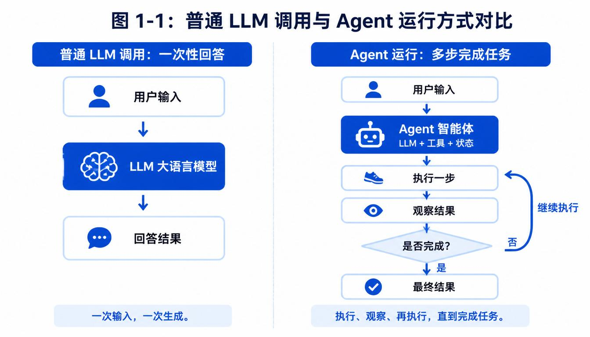
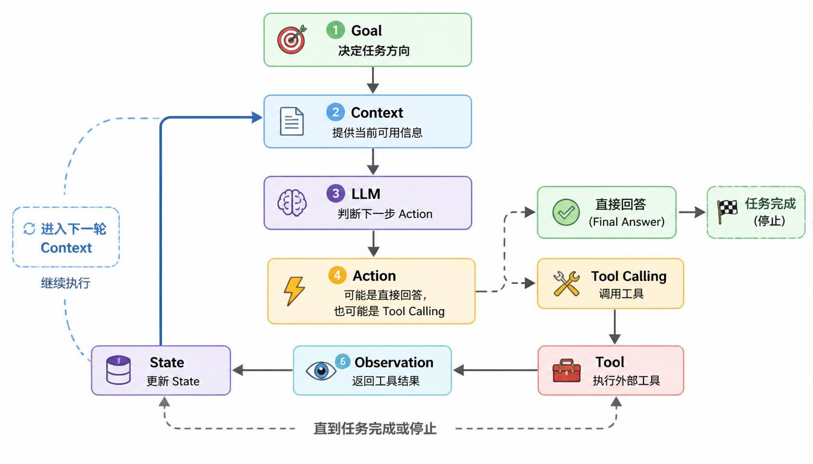

**AI Agent Fundamentals and Systems Thinking**

# Chapter 1 - The Basic Definition of an Agent

*From model output to goal-driven systems*

The word "Agent" is used everywhere now. Sometimes it is translated as "intelligent agent"; sometimes people keep the English term. In different contexts, people mean different things by it. Some people treat an Agent as a smarter chatbot. Some see it as an automation assistant. Some see it as a large-model application that can call tools. Others see it as a new form of software system.

**Each of those views touches one part of Agent, but none of them is complete.**

This chapter is not trying to give Agent a polished but empty definition. Its purpose is to build a judgment framework that can be reused throughout the rest of the book. After this chapter, you should be able to judge whether a system is only a normal LLM call, or whether it already has the structural traits of an Agent.

> **Chapter Route**
>
> We will first distinguish Agents from ordinary chatbots, then explain why LLMs are the capability foundation of modern Agents. After that, we will unpack Goal, Context, Tool, State, and Feedback Loop. Finally, we will compare the boundaries between Agent, Automation, Workflow, and Copilot.
>
> This chapter introduces many terms, but it is not a terminology exam. Build the map first: know what problem each term solves and roughly where it sits in an Agent system.

> **Terminology Note**
>
> This book keeps common English terms used in Agent engineering. The first time an important term appears, it is explained in plain language. After that, the English term is used consistently.
>
> This is not meant to make reading harder. It keeps the book aligned with mainstream technical documents, framework docs, research papers, and engineering practice.

## 1.1 Why an Agent Is Not Just a Chatbot

Many people first meet Agents through chat products. The user types a sentence, the system returns an answer. The user asks a follow-up, and the system keeps answering. Because that experience feels natural, many people describe an Agent as "a more advanced chatbot."

That view is only partly right.

A chatbot is mainly organized around conversation. Its core job is to understand an input and generate a response. It can answer questions, explain ideas, organize content, and assist with writing or analysis.

**An Agent is organized more strongly around task completion.** It does not only answer what the user asked. It tries to move toward what the user wants to accomplish. This difference is central: **a normal chatbot usually generates output for one input, while an Agent behaves more like a goal-oriented system.** It needs to understand the goal, assemble context, choose actions, call tools when needed, observe results, and adjust what it does next.

> **Short Definition**
>
> **An Agent is a software system that continues acting around a goal.**
>
> This short definition gives the direction first: the key point of an Agent is not "chatting"; it is "moving a task forward around a goal." A fuller definition appears in Section 1.3.

Before defining Agent in full, we need to understand its most important capability source: the LLM.

## 1.2 LLM: The Capability Foundation of Agents

LLM stands for Large Language Model. In this book, unless stated otherwise, LLM mainly refers to models that can process and generate language. Broader "foundation models" may include vision, audio, image, and multimodal models, but the first half of this book focuses mostly on LLM-based Agents.

An LLM can understand questions, generate text, summarize material, translate content, write code, and make certain judgments based on the information given to it.

> **Hold This First**
>
> This chapter does not discuss how LLMs are trained. You do not need to understand parameter counts, training data, or inference acceleration yet.
>
> For now, remember this: **LLM is a common capability foundation for Agents. It provides language understanding, content generation, and some judgment. But an LLM by itself is not an Agent.**

Common LLM families include GPT, Claude, Gemini, Qwen, DeepSeek, and others. The point is not to rank them. The point is that an Agent's understanding, generation, summarization, explanation, and partial judgment usually come from an underlying LLM.

A normal LLM call often looks like this:

**Pseudocode 1-1: A normal LLM call**

```text
# One input, one output
user_input = receive_user_input()
context = build_context(user_input)
answer = LLM.generate(context)
return answer
```

This pseudocode is not about a specific programming language. It says that a normal LLM call is often a one-shot flow: the system turns the current input into context, sends it to the LLM, receives an answer, and stops.

An Agent has a different structure. **Only when the surrounding system adds goal management, tool calling, state tracking, feedback loops, permission control, and stop conditions does the LLM start to participate in an Agent-like structure.**

> **Key Boundary**
>
> The LLM provides the capability foundation.
>
> The Agent is the task-execution system built around that capability.
>
> In short:
>
> **LLM is the model. Agent is the system.**
>
> **LLM generates answers. Agent completes tasks.**
>
> **Agent usually means LLM + tools + state + execution loop.**



At this point, hold one boundary: **LLM is a model, while Agent is a system organized around model capability.** Now we can unpack what an Agent is made of.

## 1.3 Agent Definition: Goal, Context, Tool, and Feedback Loop

With LLM as the capability base, we can define Agent more accurately.

> **Reading Note**
>
> This section introduces terms that will return throughout the book: Goal, Context, Tool, State, and Feedback Loop. You do not need to master every detail now.
>
> The job here is to build the map: what each term roughly means, and why they appear together in an Agent system.

> **Full Definition**
>
> **An Agent is a software system centered on a Goal, with LLM participation in decision-making, that can use Context to call Tools, execute Actions, receive Observations, update State, and adjust behavior.**

**An Agent is not a single module. It is a runtime structure composed of multiple modules.** Understanding each word separately is not enough. What matters is how they form a minimal closed loop.

A "closed loop" means the system does not do only one step and stop. It executes, receives a result, then uses that result to decide what to do next. **This looping structure is where much of an Agent's power comes from.**



The relationship between the core concepts can be understood this way:

**Goal** decides where the Agent should go. Without a Goal, the system is merely responding to input, not moving a task forward.

**Context** decides what the Agent can use for the current judgment. It may include the user request, system instructions, conversation history, tool results, current State, and safety rules.

**Action** is what the Agent will do next. It may generate an answer, call a Tool, ask the user for confirmation, or stop the task.

**Tool Calling** is one kind of Action. If the Agent judges that it lacks information or needs an external capability, it may call a tool such as web search, file reading, database query, or code execution.

**Observation** is the result returned after an Action. If the Action is Tool Calling, the Observation may be search results, file contents, database results, or test errors. If the Action asks the user for confirmation, the user's confirmation or refusal is also an Observation.

**State** records how far the task has progressed. It tells the Agent what has been done, what information has been collected, what is missing, and whether the task should continue or stop.

**Feedback Loop** ties these parts together. The Agent updates State from Observation, puts the new State back into Context, and lets the LLM make the next judgment.

> **Hold This First**
>
> You do not need to master Goal, Context, Tool, State, Observation, and Feedback Loop all at once.
>
> Remember the core idea: **an Agent is not "a model that can chat"; it is a system that organizes LLM, Context, Tool, State, and Feedback Loop around a Goal.**

**The loop can be represented as pseudocode:**


> **Hold This First**
>
> This pseudocode is not about syntax. Read the relationships: the Agent receives a goal, maintains state, builds context, and lets the LLM decide the action. If the action is `tool_call`, the system executes the tool and writes the observation back into state.
>
> The key is not whether the Agent can call a tool once. The key is whether it can keep moving a task through Goal, Context, Action, Observation, and State.

## 1.4 Agent in a Real Task: A Data Analysis Agent

The definition and minimal loop are useful, but they can still feel abstract. Let us place them into a concrete task.

> **Running Case: Data Analysis Agent**
>
> This book repeatedly uses a "data analysis Agent" as the running case. It is not the only form of Agent, but it is a good learning case because it covers Goal, LLM, Prompt, Context, Tool, State, RAG, Evaluation, and Security.
>
> Instead of switching scenarios every chapter, we will watch the same Agent become more complete as the chapters progress.

Suppose the user says:

> **Help me analyze the main changes in the new-energy vehicle industry over the last three months, and organize them into a structured report.**

If the current date is July 8, 2026, "the last three months" might roughly mean April 8, 2026 to July 8, 2026. In a real system, it might also mean natural months, such as April, May, and June 2026. The exact business definition may need confirmation.

This request contains several pieces of information:

> Topic: new-energy vehicle industry  
> Time range: last three months  
> Task type: analyze changes  
> Output form: structured report  
> Implied requirements: use recent material, support conclusions with evidence, do not write from memory alone

A normal LLM app might immediately generate a fluent-looking analysis from its existing knowledge. The answer may read well, but freshness, source reliability, and factual basis are unclear.

**The data analysis Agent should not immediately write an answer. It should move the task forward step by step.**

## 1.4.1 Goal: Clarify What the Task Really Requires

In this example, the Goal is not simply "answer the user." A better Goal is:

> **Based on relevant material from the last three months, analyze the main changes in the new-energy vehicle industry and produce a structured report.**

This Goal contains at least four constraints: the topic is the new-energy vehicle industry, the time range is the last three months, the task type is analysis, and the deliverable is a structured report.

The Goal keeps the Agent from drifting into casual conversation. If the Goal is unclear, Context assembly, Tool choice, State update, and Evaluation all become messy.

## 1.4.2 Context: What the Agent Can Use for the Current Judgment

After clarifying the Goal, the Agent needs to assemble Context. At the beginning, Context may include:

> Original user request: analyze changes in the new-energy vehicle industry  
> Current task goal: generate a structured analysis report  
> Time range: 2026-04-08 to 2026-07-08, provisional  
> Output requirement: structured report  
> Current State: no evidence collected yet  
> Available tools: search, document reading, database query, report drafting

Context is not equal to "everything the system knows." Context is the information selected for the current model call. A good Agent must decide what to include, what to omit, and how to order it.

## 1.4.3 Tool and Tool Calling: How the Agent Gets External Material

Because the task requires recent industry information, the Agent cannot rely only on the LLM's internal knowledge. It needs external material.

Possible Tools include:

- Web search for recent market news.
- Industry report retrieval.
- Company announcement lookup.
- Database or spreadsheet query.
- Document reading.

The Agent may decide:

> Current information is insufficient. Call the search tool with queries about sales, policy, pricing, and battery cost changes in the last three months.

That decision is Tool Calling. The model may suggest the call, but the system runtime decides whether the call is allowed, how to validate the parameters, and how to execute it.

## 1.4.4 Observation: What the Tool Returned

After the tool runs, it returns an Observation. For example:

> Sales data: deliveries fluctuated in recent months.  
> Policy data: some regions adjusted subsidy and trade-in policies.  
> Pricing data: several automakers changed model prices or promotions.  
> Battery cost data: raw material price movement affected vehicle pricing and margins.

Observation is not the final answer. It is new information that must be written into State, filtered, summarized, and used in the next round of Context.

## 1.4.5 State and Feedback Loop: How the Task Keeps Moving

State records progress:

> Goal: analyze changes in the new-energy vehicle industry  
> Done: sales changes, policy changes  
> Missing: price changes, battery cost changes  
> Observations: collected tool results  
> Next step: collect remaining information or start drafting

After each Observation, the Agent updates State. Then the new State is assembled into the next Context. The LLM makes the next judgment. This is the Feedback Loop.

Without State, every call feels like starting over. Without Feedback Loop, the Agent can only do one step. With State and Feedback Loop, the Agent can keep pushing the task toward a deliverable.

## 1.5 Agent and Automation: Fixed Rules Versus Dynamic Judgment

Automation is not the same as Agent. A traditional automation system usually follows fixed rules:

> If condition A occurs, execute action B.

That is valuable and often more reliable than an Agent. But it is different from an Agent because the path is mostly predefined.

An Agent can handle tasks where the next step depends on the current Goal, Context, State, and Observation. It may choose different actions across different runs.

| Dimension | Automation | Agent |
| --- | --- | --- |
| Core logic | Predefined rules | Dynamic task judgment |
| Path | Mostly fixed | Can change by context |
| External capability | Called by fixed workflow | Selected by current need |
| State | Often simple | Central to continuity |
| Best for | Stable repetitive processes | Open-ended multi-step tasks |

Automation is not inferior. In many production systems, the best architecture combines both: deterministic workflow handles stable parts, while Agent logic handles parts that require flexible judgment.

## 1.7 Agent and Workflow: Process Control Versus Local Autonomy

A Workflow controls the process. It defines stages, dependencies, approvals, retries, and handoffs. A Workflow may include an Agent, but a Workflow itself is not necessarily an Agent.

For example, a report-generation workflow might have stages:

1. Collect sources.
2. Extract evidence.
3. Draft the report.
4. Review facts.
5. Export the final file.

An Agent may operate inside one or more of those stages. It may decide which sources to search, which evidence is relevant, or how to revise the draft. The Workflow provides the outer structure, while the Agent provides local judgment and action.

## 1.8 Agent and Copilot: Assisting People Versus Acting on Behalf of People

A Copilot mainly assists a human. It suggests, explains, drafts, and helps the user act faster. The human remains the main operator.

An Agent may take delegated action. It can continue working after the user provides a goal, call tools, update state, and return a result. The human may still supervise, approve risky actions, or take over when needed.

The difference is not whether there is a chat box. The difference is who is driving the task:

| System type | Main driver | Typical behavior |
| --- | --- | --- |
| Copilot | Human | Suggests and assists |
| Agent | System under a goal | Plans, acts, observes, and continues |

## 1.9 Agent Autonomy Is Not "The Higher the Better"

Autonomy means how much the system can decide and execute by itself. Higher autonomy is not always better.

For low-risk tasks, such as summarizing public material, the Agent can be more autonomous. For high-risk tasks, such as sending emails, modifying production data, making purchases, or changing permissions, the system should require confirmation or block the action.

Good Agent design does not ask, "How do we make it fully autonomous?" It asks:

> Which decisions can the system make by itself?  
> Which actions require user confirmation?  
> Which actions are never allowed?  
> What must be logged for review?

Autonomy must be matched with risk, permission, observability, and recovery.

## 1.10 How to Judge Whether a System Is an Agent

You can use this checklist:

- Does the system have a Goal beyond one-shot answering?
- Does it maintain State across steps?
- Can it choose Actions based on Context?
- Can it call Tools or use external capabilities?
- Does it receive Observations and use them to update State?
- Does it have a Feedback Loop?
- Does it know when to stop, ask for help, or escalate?
- Are permissions and risky actions controlled by the runtime, not only by the model's self-restraint?

If most answers are "yes," the system has an Agent-like structure. If it only receives one input and returns one answer, it is likely a normal LLM application.

## 1.11 Integrated View

An Agent is best understood as a task-execution system:


The LLM contributes understanding, generation, and judgment. Tools provide external capabilities. State records progress. Context carries the current working information. The runtime controls execution, permissions, and stopping. The Feedback Loop lets the system continue.

The value of the Agent does not come from a single component. It comes from the way these components are connected.

## Chapter Summary

This chapter established the first boundary of the book:

- An Agent is not just a chatbot.
- An LLM is not the same as an Agent.
- The LLM is the capability foundation, while the Agent is the system structure.
- A minimal Agent includes Goal, Context, Action, Tool Calling, Observation, State, and Feedback Loop.
- Automation, Workflow, Copilot, and Agent overlap, but they solve different problems.
- Autonomy should be designed according to risk, not maximized blindly.

From the next chapter, we will look more closely at the LLM itself: what capabilities it gives to Agents, and where its boundaries are.
