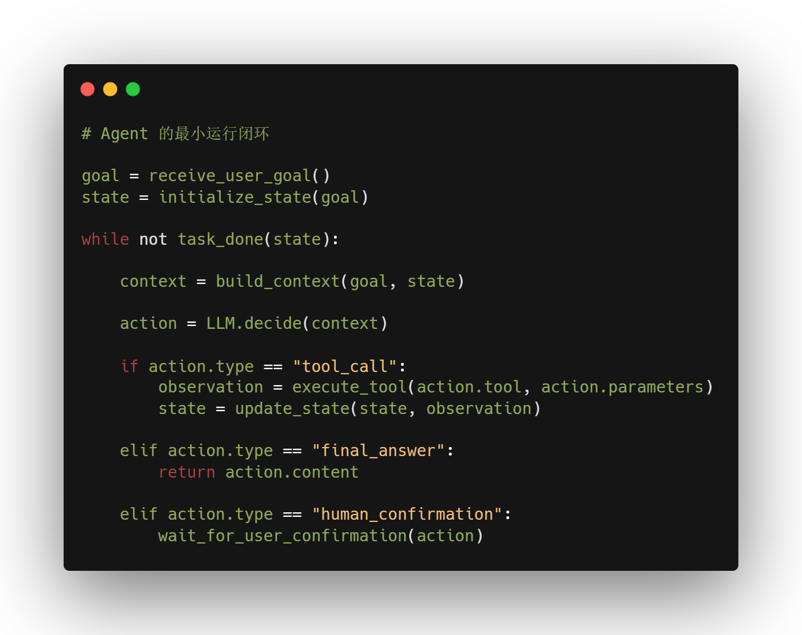
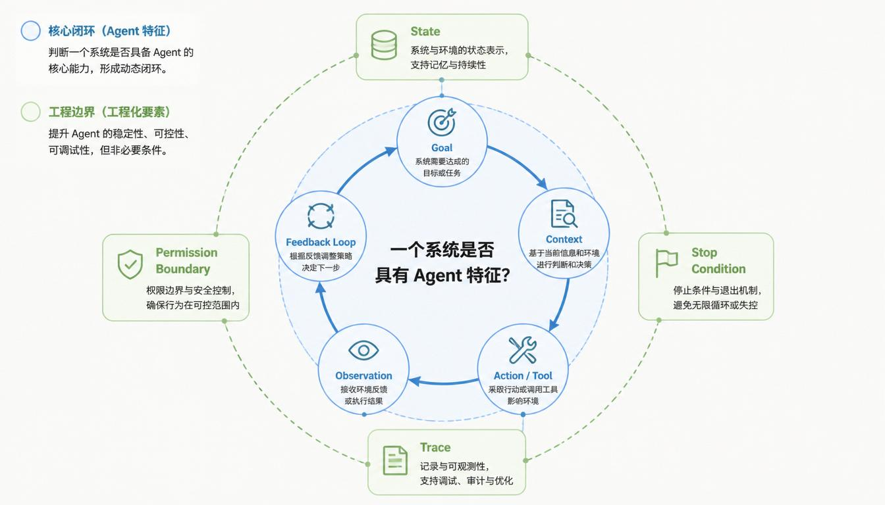

**AI Agent 入门与系统思维**

# 第 1 章  Agent 的基本定义

*从模型输出到目标驱动系统*

“Agent”这个词现在被使用得很频繁。它有时被翻译成“智能体”，有时直接保留英文。不同语境下，人们对它的理解并不完全一致：有人把 Agent 理解成更聪明的聊天机器人，有人把它理解成自动化助手，有人把它理解成能够调用工具的大模型应用，也有人把它看作一种新的软件系统形态。

**这些理解都触碰到了 Agent 的一部分，但都不完整。**

本章要做的事情不是给 Agent 下一个漂亮但空泛的定义，而是**建立一个后续学习可以反复使用的判断框架**。读完本章，你应该能够判断：**一个系统只是普通的 LLM 调用，还是已经具备了 Agent 的结构特征。**

> **本章路线**
>
> 本章会按这样的顺序展开：先区分 Agent 和普通聊天机器人，再解释 LLM 为什么是 Agent 的能力基础，然后拆解 Goal、Context、Tool、State 和 Feedback Loop，最后比较 Agent、Automation、Workflow 和 Copilot 的边界。
>
> 这一章会出现不少术语，但**它不是术语考试。**你只需要先建立概念地图，知道每个词解决什么问题、在 Agent 系统里大概处于什么位置。

> **术语说明**
>
> 本书会保留 Agent 领域中的常用英文术语。第一次出现时，会给出中文解释、英文原词和必要的缩写；解释完成后，后文会优先使用英文术语。
>
> 这样做不是为了制造阅读门槛，而是为了和主流技术资料、框架文档、论文和工程实践保持一致。读者不需要一开始记住所有英文词，每个关键术语出现时，本书都会说明它解决什么问题、当前只需要掌握到什么程度。

## 1.1 为什么不能只把 Agent 理解成聊天机器人

很多人第一次接触 Agent，是从聊天产品开始的。用户输入一句话，系统返回一段回答；用户继续追问，系统继续回答。这个体验很自然，所以不少人会把 Agent 直接理解成“更高级的聊天机器人”。

但这个理解只说对了一部分。

聊天机器人主要面向对话。它的核心任务是理解用户输入。聊天机器人可以回答问题、解释概念、整理内容，也可以在一定程度上辅助写作和分析。

**Agent 则更强调任务完成过程。**它不只是回答“你问了什么”，还要围绕“你想完成什么”展开行动。这个差别很关键：**普通聊天机器人通常围绕单次输入生成输出，而 Agent 更像一个面向 目标运行的系统。**它需要理解目标、组织 Context、选择 Action、必要时调用 Tool、观察结果，并在必要时调整后续行动。

> **短定义**
>
> **Agent 是一种围绕 目标持续行动的软件系统。**
>
> 这个短定义先帮你抓住方向：**Agent 的重点不是“聊天”，而是“围绕目标推进任务”。**更完整的定义会在 1.3 节展开。

在进入 Agent 的完整定义之前，先要理解它最重要的能力来源：LLM。

## 1.2 LLM：Agent 的能力基础

大语言模型，英文是 Large Language Model，通常缩写为 LLM。中文语境里常把它放在“大模型”这一更宽泛的说法下讨论，但在本书前半部分，除非特别说明，我们主要讨论的是 LLM。

这里需要稍微区分一下：“大模型”是更宽泛的说法，可以包括语言模型、视觉模型、语音模型和多模态模型；LLM 更准确地指大语言模型，也就是能够处理和生成语言内容的模型。到了后面的多模态 Agent 章节，我们才会进一步扩展到视觉、语音、图像等多模态模型。

LLM 可以理解问题、生成文本、总结资料、翻译内容、编写代码，也可以根据输入信息进行一定程度的推理和判断。

> **先掌握到这里**
>
> 本章不讨论 LLM 的训练原理，也不要求你理解参数规模、训练数据、推理加速等底层细节。
>
> 现在只需要理解：**LLM 是 Agent 常用的能力基础，负责语言理解、内容生成和部分判断；但 LLM 本身不等于 Agent。**

常见的 LLM 包括 GPT 系列、Claude、Gemini、Qwen、DeepSeek 等。这里列举这些名称，不是为了比较哪一个模型更强，而是为了说明：Agent 的很多能力并不是凭空产生的，它的理解、生成、归纳、解释和部分判断能力，通常来自底层的 LLM。

一次普通的 LLM 调用通常是这样的：

**伪代码 1-1：普通 LLM 调用**

```text
# 一次输入，一次输出
user_input = receive_user_input()
context = build_context(user_input)
answer = LLM.generate(context)
return answer
```

这段伪代码不要求你掌握具体编程语法。它想表达的是：普通 LLM 调用通常是一次性的，系统把当前输入组织成 Context，交给 LLM，LLM 生成结果，流程就结束了。

Agent 的结构则不同。**只有当外部系统为 LLM 设计了 Goal 管理、Tool Calling、State 记录、Feedback Loop、权限控制和停止条件之后，它才开始具备 Agent 的结构。**

> **关键边界**
>
> LLM 提供能力基础。
>
> Agent 是围绕 LLM 能力构建出来的任务执行系统。
>
> 所以，**Agent 不等于 LLM 本身，而是 LLM 参与其中的一种系统形态。**
>
> 再简单点
>
> **LLM 是模型，Agent 是系统。**
>
> **LLM 生成回答，Agent 完成任务。**
>
> **Agent 通常 = LLM + 工具 + 状态 + 执行循环。**


读到这里，先掌握一个边界即可：**LLM 是模型，Agent 是围绕模型能力组织起来的系统。**接下来，我们会进一步拆开 Agent 的定义，看看它到底由哪些关键部分组成。

## 1.3 Agent 的定义：Goal、Context、Tool 与 Feedback Loop

有了 LLM 这个基础，我们可以更准确地定义 Agent。

> **阅读提示**
>
> 这一节会出现几个后面反复使用的概念，例如 Goal、Context、Tool、State 和 Feedback Loop。你不需要在这里一次性掌握它们的全部细节。
>
> 本章的任务只是先建立一张概念地图：知道这些词大致指什么，以及它们为什么会一起出现在 Agent 系统里。后续章节会分别展开这些概念。

> **完整定义**
>
> **Agent 是一种以 Goal 为中心、由 LLM 参与决策，并能够根据 Context 调用 Tool、执行 Action、接收 Observation、更新 State 和调整行为的软件系统。**

**一个 Agent 并不是某个单独模块，而是多个模块组合后的运行结构。**单独理解这些词还不够，更重要的是看它们如何连成一个最小运行闭环。

这里的“闭环”指的是：系统不是只执行一步就结束，而是在执行后接收结果，再根据结果继续判断下一步。**Agent 的关键能力，正是来自这种循环结构。**

一个最小 Agent 闭环可以理解成下面这几个步骤：


**这几个概念的关系可以这样理解。**

**Goal** 决定 Agent 要往哪里走。没有 Goal，系统就只是在回应输入，而不是推进任务。

**Context** 决定 Agent 当前能根据什么做判断。它可能包括用户请求、系统指令、历史对话、Tool 返回结果、当前 State 和安全规则。

**Action** 是 Agent 下一步要做的事情。Action 可以是生成一段回答，也可以是调用某个 Tool，也可以是请求用户确认，还可以是停止任务。

**Tool Calling** 是 Action 的一种。当 Agent 判断当前信息不足，或者任务需要外部能力时，它可能会调用 Tool。例如搜索网页、读取文件、查询数据库、运行代码。

**Observation** 是 Action 之后返回的结果。如果 Action 是 Tool Calling，那么 Observation 可能是搜索结果、文件内容、数据库查询结果或测试报错。如果 Action 是请求用户确认，那么用户的确认或拒绝也可以成为新的 Observation。

**State** 记录任务推进到了哪里。它让 Agent 知道已经完成了哪些步骤、获得了哪些信息、还缺什么、下一步应该继续还是结束。

**Feedback Loop** 则把这些环节串起来。Agent 根据 Observation 更新 State，再把新的 State 放回 Context，让 LLM 做下一轮判断。

> **先掌握到这里**
>
> 这里不需要一次性掌握 Goal、Context、Tool、State、Observation 和 Feedback Loop 的全部细节。
>
> 先记住一个核心意思：**Agent 不是“一个会聊天的模型”，而是“一个围绕 Goal 组织 LLM、Context、Tool、State 和 Feedback Loop 的系统”。**

**下面用一段伪代码表示这个闭环：**



> **先掌握到这里**
>
> 这段伪代码不要求你掌握具体编程语法。你只需要看懂几个核心关系：Agent 接收 goal，维护 state，组织 context，让 LLM 判断 action。如果 action 是 tool\_call，系统会执行 Tool，并把 observation 写回 state。
>
> 通过这个闭环可以看到，**Agent 的重点不是“会不会调用 Tool”，而是能不能在 Goal、Context、Action、Observation 和 State 之间形成持续推进任务的结构。**

## 1.4 真实任务中的 Agent：以资料分析 Agent 为例

前面你已经把 Agent 的定义和最小运行闭环讲清楚了：**Agent 不是某个单独模块，而是围绕 Goal，把 Context、Action、Tool Calling、Observation、State 和 Feedback Loop 组织起来的系统。**

不过，只看概念和闭环，可能还会觉得这些词有点抽象。接下来，我们用一个更接近真实任务的例子，把这些概念放回一个完整场景中。

> **贯穿案例：资料分析 Agent**
>
> 本书后续会反复使用“资料分析 Agent”作为贯穿案例。它不是唯一的 Agent 形态，但非常适合作为学习案例，因为它能同时覆盖 Goal、LLM、Prompt、Context、Tool、State、RAG、Evaluation 和 Security 等核心问题。
>
> 为了避免例子过多、过散，本书不会每章都换一个场景。我们会尽量围绕资料分析 Agent 展开，看同一个 Agent 如何随着章节推进不断变得更完整。

> **先掌握到这里**
>
> 这一节不是要真正完成一份行业报告，也不是要判断新能源汽车行业的真实走势。
>
> 这里的重点是：**通过一个具体任务，看清 Agent 如何把用户请求拆成 Goal、Context、Tool Calling、Observation、State 和 Feedback Loop。**

假设用户对资料分析 Agent 说：

> **帮我分析最近三个月新能源汽车行业的主要变化，并整理成一份结构化报告。**

如果当前日期是 2026 年 7 月 8 日，那么“最近三个月”可以先粗略理解为 2026 年 4 月 8 日到 2026 年 7 月 8 日。当然，在真实系统中，“最近三个月”也可能按自然月计算，例如 2026 年 4 月、5 月、6 月，具体口径需要根据业务要求确认。

这句话看起来只是一个普通请求，但对于 Agent 来说，它已经包含了多个需要处理的信息：

> 主题：新能源汽车行业  
> 时间范围：最近三个月  
> 任务类型：分析变化  
> 输出形式：结构化报告  
> 隐含要求：资料要新，结论要有依据，不能只凭印象编写

如果是普通 LLM 应用，它可能直接根据已有知识生成一段看起来完整的分析。这样的回答可能语言流畅，但资料是否足够新、来源是否可靠、结论是否基于真实资料，都不一定清楚。

**资料分析 Agent 的目标不是“马上写一段回答”，而是围绕这个任务逐步推进。**

## 1.4.1 Goal：先明确任务真正要完成什么

在这个例子中，Goal 不是简单的“回答用户问题”，而是：

> **基于最近三个月的相关资料，分析新能源汽车行业的主要变化，并生成一份结构化报告。**

这个 Goal 至少包含四个约束：主题是新能源汽车行业，时间范围是最近三个月，任务类型是分析主要变化，输出形式是结构化报告。

Goal 的作用，是让 Agent 知道自己不是在做闲聊，而是在完成一个有方向、有边界、有交付物的任务。如果 Goal 不清楚，后面的 Context 组织、Tool 选择、State 更新和 Evaluation 都会变得混乱。

## 1.4.2 Context：Agent 当前能依据什么做判断

确定 Goal 之后，Agent 需要组织 Context。刚开始时，Context 可能包括：

> 用户原始请求：分析最近三个月新能源汽车行业变化  
> 当前任务目标：生成结构化分析报告  
> 时间范围：2026-04-08 到 2026-07-08（暂定）  
> 输出要求：结构化报告  
> 系统规则：不能编造来源；不确定信息要标注；结论应尽量基于可追溯资料

这时的 Context 还比较薄。它主要来自用户请求和系统规则。随着任务推进，Context 会不断变化：搜索结果、网页摘要、文档内容、可信来源列表，都可能进入新的 Context。

## 1.4.3 Tool 与 Tool Calling：Agent 如何获得外部资料

这个任务依赖最新资料，单靠 LLM 的已有知识通常不够。因此，Agent 需要使用 Tool。

> 搜索 Tool：检索最近三个月相关新闻、政策、报告和数据  
> 网页读取 Tool：提取正文、发布时间、来源名称和关键信息  
> 文档读取 Tool：读取行业 PDF 报告、财报、研究机构报告  
> 表格处理 Tool：整理销量、价格、出口、补贴、市场份额等数据  
> 来源检查 Tool：检查资料来源、发布时间、作者或机构可信度

**这些 Tool 不是 LLM 本身的能力。**LLM 可以判断“我需要查找最近三个月的行业资料”，但**真正搜索网页、读取 PDF、提取表格的，是系统开放给 Agent 的 Tool。**

当 Agent 判断当前信息不足时，它可能发起一次 Tool Calling。例如：

```text
Tool: search_web
purpose: 检索新能源汽车行业最近三个月的主要变化
query: 新能源汽车 行业变化 最近三个月 政策 销量 价格 出口 电池成本
date_range: 2026-04-08 to 2026-07-08
limit: 10
```

**这一步不是 LLM 自己“上网”，而是 LLM 根据 Context 生成调用意图和参数，然后由系统执行搜索 Tool。**

## 1.4.4 Observation：Tool 返回了什么

Observation 指 Action 执行之后返回给 Agent 的结果。如果刚才调用的是搜索 Tool，那么 Observation 可能是：

> 某研究机构发布新能源汽车销量报告，发布时间为 2026 年 6 月  
> 某地区发布新能源汽车补贴政策调整通知，发布时间为 2026 年 5 月  
> 多家车企调整车型价格，相关新闻集中在 2026 年 4 月到 6 月  
> 动力电池价格变化影响整车成本，来源为行业分析文章  
> 新能源汽车出口数据增长，来源为行业协会或官方统计

**这些 Observation 还不是最终结论。它们只是 Agent 下一步判断的依据。**Agent 接下来需要判断哪些来源可信、哪些资料有明确发布时间、哪些信息可以支持“主要变化”的结论，哪些信息还不足以作为报告依据。

## 1.4.5 State 与 Feedback Loop：任务如何持续推进

State 记录任务推进到了哪里。第一次搜索之后，State 可能更新为：

> 任务目标：生成新能源汽车行业最近三个月变化的结构化报告  
> 当前阶段：资料筛选  
> 已完成：初步搜索资料  
> 已获得信息：销量变化、政策变化、价格变化、电池成本变化、出口变化  
> 待完成：打开关键来源、核对发布时间、提取可靠证据、整理主要变化

**State 的作用是让 Agent 不会每一步都像重新开始。**如果没有 State，Agent 可能会重复搜索同样资料，也可能忘记已经发现的问题，还可能在资料不足时过早生成报告。

Feedback Loop 则让 Agent 根据 Observation 不断调整下一步行动。例如：

> 第一次搜索后发现资料太杂 → 调整关键词，增加“官方数据”“行业报告”等限制  
> 读取网页后发现某些内容没有发布时间 → 降低该来源可信度，继续寻找更明确的来源  
> 生成初稿后发现缺少政策变化 → 再次调用搜索 Tool，专门查政策信息  
> 检查报告时发现某个结论缺少引用 → 回到资料阶段补充来源

当然，**Feedback Loop 也不能无限循环。**真实系统通常需要设置 Stop Condition，例如资料已经足够、报告已经完成、达到最大搜索次数、达到时间或成本限制，或者需要用户确认是否继续。

> **先掌握到这里**
>
> 这一节只需要理解：Agent 如何把一个用户请求转化成可执行任务；它为什么需要 Tool；**Tool 返回的 Observation 如何影响下一步**；State 为什么能让任务连续推进；**Feedback Loop 为什么是 Agent 区别于一次性回答的关键。**
>
> 后面的章节会继续展开这些问题。第 3 章会讲 Agent 的核心结构，第 4 章会讲 Planning、Action、Observation 与 ReAct，第 6 章会深入讲 Tool Calling，第 7 章会讲 State 和 Memory，第 9 章会讲 RAG，第 13 章会用资料分析 Agent 把这些模块串成一个完整案例。

到这里，我们已经从概念地图、最小闭环和真实任务三个层次理解了 Agent。接下来要进一步看清一个边界：**并不是所有自动执行的系统都应该叫 Agent，也不是所有任务都需要 Agent。**为了避免把 Agent 和传统自动化混在一起，下一节先比较 Agent 与 Automation。

## 1.5 Agent 和 Automation：固定规则与动态判断

> **阅读提示**
>
> 接下来会比较 Agent 和 Automation。这里不是为了学习传统自动化开发，而是为了区分两类系统的边界：什么时候应该用固定规则，什么时候才需要引入 Agent。

Automation，中文常译为“自动化”，指系统按照预先设定的规则自动执行任务。自动化脚本就是一种常见的 Automation 形式。脚本可以理解为一段按固定逻辑运行的程序，例如每天定时抓取数据、生成报表、发送邮件。

```text
每天上午 9 点读取销售数据
  ↓
计算昨日销售额
  ↓
生成统计表
  ↓
发送到指定邮箱
```

这类任务非常适合 Automation，因为流程固定、输入稳定、判断规则明确。只要数据格式没有变化，脚本可以非常可靠、快速、低成本地运行。

Agent 适合处理的任务则往往更开放。例如用户的问题表达不完整，资料来源不固定，中途需要判断哪些信息重要，输出结构也可能根据内容变化。这些场景如果完全写死规则，系统会变得笨重而脆弱。

但这不意味着 Agent 比 Automation “更高级”，也不意味着所有自动化都应该改成 Agent。相反，在真实系统中，**能用确定性规则解决的问题，通常应该优先用确定性规则解决。**

> **设计原则**
>
> **规则明确的部分，用 Automation。**
>
> **需要理解和判断的部分，用 LLM 或 Agent。**
>
> **风险较高的部分，加入 Human Confirmation。**

> **先掌握到这里**
>
> Agent 和 Automation 的核心差异是：**Automation 强调固定规则，Agent 强调动态判断。**
>
> **真实系统不是在二者之间二选一，而是要判断每个环节更适合确定性规则，还是更适合 LLM 参与判断。**

不过，真实业务系统很少只有一个脚本，也很少完全放任 Agent 自主行动。更多时候，一个任务会被拆成多个步骤：先收集数据，再处理数据，再生成结果，再交给人确认。这样的多步骤安排，就进入了另一个概念：Workflow。

## 1.7 Agent 和 Workflow：流程控制与局部自主

> **阅读提示**
>
> Workflow 是工程和业务系统里常见的概念。这里不要求你掌握工作流引擎或流程编排工具，只需要理解它和 Agent 的区别：Workflow 更强调流程可控，Agent 更强调动态判断。

Workflow，中文常译为“工作流”，指一组按顺序或条件组织起来的任务步骤。它强调流程编排：先做什么，后做什么，什么情况下分支，失败后怎么处理，哪些步骤需要人工审批。

```text
员工提交报销单
  ↓
系统检查发票格式
  ↓
直属领导审批
  ↓
财务复核
  ↓
打款
  ↓
归档
```

这个流程不一定需要 LLM，因为步骤和规则相对明确。Workflow 的价值在于稳定、可控、可管理。

Agent 和 Workflow 的区别在于：**Workflow 更强调预设流程，Agent 更强调基于 Goal 和 Context 的动态判断。**

但在实际应用中，**二者经常结合，而不是互相替代。**一个系统可以**用 Workflow 控制主流程，用 Agent 处理其中不确定、开放、需要语言理解或综合判断的部分。**

这种混合形态常被称为 Agentic Workflow。Agentic 可以理解为“带有 Agent 特征的”。**Agentic Workflow 指的是：整体流程仍然由 Workflow 控制，但其中某些步骤引入 Agent 的判断、生成、Tool Calling 或 Feedback Loop。**

例如资料分析任务可以设计成一个 Workflow：

```text
确定主题
  ↓
收集资料
  ↓
筛选资料
  ↓
提取要点
  ↓
生成报告
  ↓
检查引用
  ↓
交付结果
```

其中，“确定主题”“生成报告”“交付结果”可以是固定流程；但“哪些资料值得看”“哪些信息重要”“不同观点如何归类”，这些环节更适合由 Agent 参与判断。

> **先掌握到这里**
>
> **Workflow 更强调流程可控，Agent 更强调动态判断。**
>
> 真实系统常常把二者结合起来：**用 Workflow 管主流程，用 Agent 处理不确定环节。**

因此，理解 Workflow 不是为了偏离 Agent，而是为了看清 Agent 在真实系统中的位置：**它往往不是替代整个流程，而是嵌入流程中，处理最需要理解和判断的部分。**

讲完 Agent 和 Workflow 的关系之后，还需要再看另一个边界：人在任务中到底处于什么位置。有些 AI 系统主要辅助人做决定，有些则会在授权范围内替人执行步骤。这个区别，就是 Agent 和 Copilot 的区别。

## 1.8 Agent 和 Copilot：辅助人与代理执行的区别

> **阅读提示**
>
> Copilot 这个词在很多产品中都会出现。这里不需要纠结不同厂商如何命名，只需要抓住核心差异：**Copilot 更偏辅助人，Agent 更偏在授权范围内执行任务。**

Copilot 可以理解为“副驾驶”或“辅助型 AI 系统”。它通常帮助人完成任务，但人仍然是主要决策者和操作者。比如代码补全、写作建议、数据分析建议、表格公式生成，都可以是 Copilot 形态。

**Copilot 的核心是辅助人，而 Agent 的核心是围绕 Goal 执行一部分任务。**两者不是绝对对立，而是自主程度不同：

> Copilot：人主导，AI 辅助。  
> Agent：Goal 主导，AI 在权限范围内执行部分步骤。  
> Automation：规则主导，系统按固定逻辑自动执行。  
> Workflow：流程主导，多步骤任务按预设结构推进。

举一个软件开发场景。一个代码 Copilot 可能在你写代码时提供补全建议，解释某段函数，或者帮你生成测试样例。你仍然需要决定是否接受它的建议。

一个 Code Agent 则可能读取项目文件，理解任务目标，修改多个文件，运行测试，根据报错继续修复，并最终给出变更说明。这个过程不只是“建议”，而是包含多步骤执行和反馈调整。

Codex 更适合放在这个语境下理解。它不是简单等同于某个基础 LLM，而是面向软件工程任务的 Agent 化系统：它会读取代码 Context，修改文件，运行命令，观察测试结果，并根据反馈继续推进任务。

区分 Copilot 和 Agent 的意义在于：我们要清楚 AI 在系统里扮演的角色。**它是在辅助用户做决定，还是在被授权后代表用户执行一部分任务？**这个区别会直接影响产品设计、权限管理、错误处理和责任边界。

> **插图 1-3：Automation、Workflow、Copilot 与 Agent 的关系**
>
> **图中要表达什么：**展示四类系统在流程固定程度和 AI 自主判断程度上的差异。
>
> **图中包含哪些元素：**横轴为流程开放程度：固定到开放；纵轴为 AI 自主判断程度：低到高。图中包含 Automation、Workflow、Copilot、Agent、Agentic Workflow 五个标签。
>
> **生图提示：**一张二维象限信息图，浅色背景，专业技术文档风格。Agentic Workflow 位于 Workflow 与 Agent 之间，表示混合形态。不要卡通人物，不要夸张未来感。

这也自然引出下一个问题：既然 Agent 可以执行更多步骤，那么是不是自主性越高越好？

## 1.9 Agent 的 Autonomy 不是越高越好

Autonomy，中文常译为“自主性”，指系统在多大程度上可以不依赖人工逐步指令，而是根据 Goal 自行判断和执行。一个低 Autonomy 的系统可能每一步都需要用户确认；一个高 Autonomy 的系统可能只需要用户给出 Goal，它就能连续完成多个步骤。

**听起来，Autonomy 越高似乎越先进。但在工程实践中，这并不成立。**

Autonomy 越高，系统能处理的不确定性越强，但风险也越高。尤其当 Agent 具备 Tool Calling 能力时，它的**错误不再只是“说错话”，还可能变成“做错事”。**

例如，一个只负责生成文案的系统，错误主要体现在内容质量上。但一个能发送邮件、修改数据库、执行代码或操作业务系统的 Agent，错误可能带来真实后果。

因此，**Agent 设计不是追求无限 Autonomy，而是要在能力和控制之间取得平衡。**一个常见的权限分层方式是：

| **动作类型** | **建议处理方式** |
| --- | --- |
| **低风险信息处理** | 可以自动执行 |
| **中风险外部操作** | 执行前给出确认 |
| **高风险不可逆操作** | 默认不允许自动执行 |
| **涉及隐私或敏感数据的访问** | 必须有明确授权和日志 |
| **影响业务结果的关键决策** | 保留人工监督 |

这里的“人工监督”常被称为 Human-in-the-loop，意思是让人参与到系统关键环节中。它不是为了降低系统智能，而是为了让高风险任务保持可控。后续章节会进一步讨论 Human-in-the-loop，也会说明它和权限、安全、审计之间的关系。

> **先掌握到这里**
>
> **Agent 的价值不是 Autonomy 越高越好，而是在合适的权限边界内完成任务。**
>
> **越能操作外部系统，越需要确认、日志、Evaluation 和安全限制。**

**一个成熟的 Agent 系统，不是让 LLM 自由行动，而是在 Goal、Context、Tool、State、权限和 Evaluation 之间建立清晰边界。**

## 1.10 判断一个系统是不是 Agent

经过前面的概念拆解，我们可以用一组问题来判断一个系统是否具有 Agent 特征。

> 它是否围绕一个明确 Goal 运行？  
> 它是否能利用 Context 做判断？  
> 它是否能在多个步骤之间维护 State？  
> 它是否能调用外部 Tool 或系统？  
> 它是否会根据 Observation 调整下一步？  
> 它是否具备任务结束或 Stop Condition？  
> 它是否有权限边界和失败处理？  
> 它的执行过程是否可以被 Trace 和 Evaluation？

**如果一个系统只是接收输入并生成回答，它更接近普通 LLM 应用。如果一个系统可以根据 Goal 拆解任务、选择 Action、调用 Tool、观察结果并继续推进，它就具备明显的 Agent 特征。**如果它还具备 Memory、RAG、多步骤 Planning、Human-in-the-loop、Trace 和 Evaluation 机制，那么它就更接近工程化 Agent 系统。

这里又出现了几个后续章节会展开的概念。

**Memory：**中文常译为“记忆”，指 Agent 在当前对话之外或较长任务过程中保留信息的能力。例如用户偏好、历史任务结果、长期项目背景等。Memory 不等于 Context。Context 是当前 LLM 调用能看到的信息，Memory 则是可以被保存、读取和更新的信息来源。

**RAG：**全称是 Retrieval-Augmented Generation，通常译为“检索增强生成”。它指系统在生成回答之前先检索相关资料，再让 LLM 基于资料生成结果。RAG 不等于 Agent，也不等于 Memory，但 Agent 可以使用 RAG 作为知识获取模块。

**Planning：**中文可理解为“规划”，指 Agent 把复杂任务拆成多个步骤，并决定执行顺序。Planning 可以很简单，例如先查资料再总结；也可以很复杂，例如根据中间结果动态调整任务路径。第 4 章会讲 Planning、Action、Observation 与 ReAct。

**Trace：**中文可理解为“执行轨迹”，指记录 Agent 执行过程中的关键事件，例如 LLM 输入、LLM 输出、Tool Calling、Observation 和 State 变化。Trace 的作用是帮助开发者分析系统行为，而不是把 Agent 当成不可解释的黑箱。

**Skill：**可以理解为 Agent 的可复用能力模块。它不是简单的 Tool，也不是单纯的 Prompt。一个 Skill 往往会把 Instruction、Tool Set、Procedure、Examples、Constraints 和 Evaluation 组合起来。第 8 章会单独展开。

**Multi-Agent：**指多个 Agent 基于角色分工协作完成任务。它不是“Agent 越多越强”，而是适合复杂、开放、需要分工和互相检查的任务。第 12 章会单独展开。

> **先掌握到这里**
>
> 这些能力不一定出现在每一个 Agent 中，但它们**共同决定了一个 Agent 系统的成熟程度。**
>
> **现在只需要能用这些问题判断一个系统是否具有 Agent 特征**，不需要立刻掌握每个能力的工程实现。

为了帮助快速判断，可以先记住下面这张边界表：

| **如果系统主要是……** | **更接近** |
| --- | --- |
| **输入一句话，输出一段回答** | 普通 LLM 应用 |
| **按固定规则定时执行任务** | Automation |
| **按预设步骤流转任务** | Workflow |
| **给人建议，人决定是否执行** | Copilot |
| **围绕 Goal 判断下一步，并能调用 Tool、更新 State** | Agent |
| **Workflow 主流程 + 局部 Agent 判断** | Agentic Workflow |



内圈用于判断它像不像 Agent；

外圈用于判断它是不是一个更可控、更工程化的 Agent 系统。

## 1.11 本章的整合视角

**理解 Agent，最重要的不是背一个定义，而是建立系统视角。**

**Agent 不是单独的 Prompt，也不是单独的 LLM，也不是单独的 Tool Calling。**Prompt 是提示词或指令，用来告诉 LLM 应该如何理解任务、遵守哪些规则、按照什么格式输出。它很重要，但它只是 Agent 系统的一部分。

Agent 是多个模块组合后的运行结构：

> Goal 决定任务方向  
> LLM 提供理解、生成和判断能力  
> Prompt 约束模型行为  
> Context 提供当前可见信息  
> Tool 连接外部系统  
> State 记录执行进度  
> Observation 影响下一步决策  
> Permission 限制可执行范围  
> Trace 帮助追踪过程  
> Evaluation 判断结果质量

这些模块彼此影响。Tool 越强，权限设计越重要；任务越长，State 管理越重要；资料依赖越强，RAG 和引用机制越重要；风险越高，Human-in-the-loop 和审计日志越重要；流程越复杂，Workflow 和 Agent 的边界越需要设计清楚。

因此，学习 Agent 不能只问：

> **怎么做一个 Agent？**

还要问：

> 这个任务是否真的需要 Agent？  
> 哪些部分需要 LLM 判断？  
> 哪些部分应该用固定 Workflow？  
> 哪些 Tool 可以开放给 Agent？  
> 哪些 Action 必须限制或确认？  
> 如何判断结果是否可靠？  
> 如果系统出错，能否通过 Trace 找到原因？

这就是 Agent 学习中的整合思维。**Agent 的价值不在于把所有事情都交给 LLM**，而在于**把 LLM 能力、Tool 能力、流程控制、知识系统、State 管理和安全边界组合成一个能够完成任务的系统。**

## 本章小结

本章建立了 Agent 的基本定义。**Agent 可以理解为一种围绕 Goal 运行的大模型应用结构。**它由 LLM 提供理解、生成和判断能力，**但不等于 LLM 本身**；它可以调用 Tool，**但不等于 Tool Calling**；它可以自动执行任务，**但不等于传统 Automation**；它可以嵌入 Workflow，**但不等于 Workflow 本身**。

更准确地说，**Agent 是 Goal、LLM、Prompt、Context、Tool、State、Observation、Permission、Trace 和 Evaluation 共同组成的系统。**

本章还区分了几个容易混淆的概念：

| **English Term** | **中文解释** | **本章中的用法** |
| --- | --- | --- |
| **Agent** | 智能体 / 代理系统 | 围绕 Goal 运行、能判断和行动的软件系统 |
| **LLM** | 大语言模型 | Agent 的能力基础之一 |
| **Context** | 上下文 | LLM 当前能看到的信息 |
| **Tool** | 工具 | Agent 可调用的外部能力 |
| **Tool Calling** | 工具调用 | Agent 选择并使用 Tool 的过程 |
| **State** | 状态 | 任务执行中的进度和中间信息 |
| **Observation** | 观察结果 | Tool 执行后返回的结果 |
| **Automation** | 自动化 | 按固定规则自动执行任务 |
| **Workflow** | 工作流 | 预设步骤组成的任务流程 |
| **Copilot** | 辅助型 AI 系统 | 人主导、AI 辅助 |
| **Agentic Workflow** | 带有 Agent 能力的工作流 | 真实系统中常见的混合形态 |

下一章可以进一步讨论 LLM 本身：它为什么能成为 Agent 的能力来源，又为什么单靠 LLM 还不足以构成一个可靠的 Agent。
