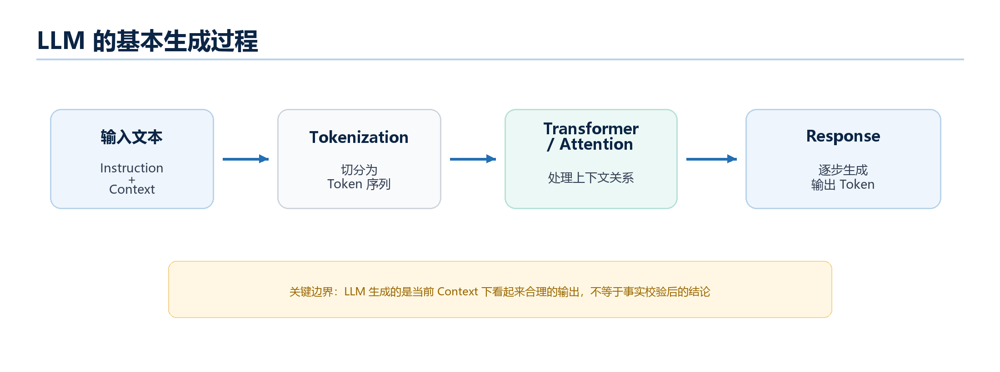
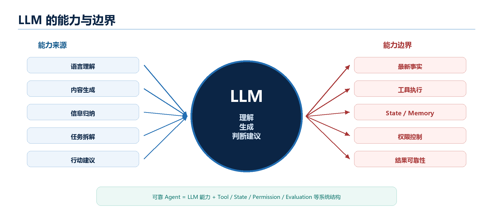

# Chapter 2 - LLM: The Source and Boundary of Agent Capabilities

*Why LLMs make Agents possible, and why LLMs alone are not enough*

> Chapter 1 established one boundary: **Agent is not equal to LLM**. However, if we do not understand LLMs at all, it is hard to understand why modern Agents can understand tasks, read material, generate plans, call tools, and keep moving through multi-step tasks.

This chapter does not pull you into model-training papers or API parameter details. It answers a more useful question for learning Agents: **what exactly does an LLM provide to an Agent?** Why are those capabilities useful? What are their limits, and which parts must be completed by system design?

> **Chapter Route**
>
> We move through five layers: why Agent learning must first understand LLMs; the basic ideas of Token, Transformer, Attention, and probabilistic generation; what roles LLMs play inside Agents; the capability boundaries of LLMs; and how all of this folds back into Agent system design.

> **Terminology Note**
>
> This chapter continues to use standard Agent terminology. You do not need to memorize every detail, but keep one main line: **LLM is a capability source. Agent is the system organized around those capabilities.**

## 2.1 Why Chapter 2 Starts with LLM

LLM stands for Large Language Model. In this book, an LLM mainly means a model that can process and generate language. It can understand user input, generate text, summarize material, explain concepts, write code, and make limited judgments based on current information.

**An Agent is a software system running around a Goal.** A data analysis Agent may have the Goal "analyze the main changes in the new-energy vehicle industry in the last three months and generate a structured report." A coding Agent may have the Goal "fix a failing test in this project."

Why start with LLM? Because many core capabilities of modern Agents come from LLMs:

- Understanding what the user really wants.
- Reading and summarizing material.
- Judging the next step from current Context.
- Generating reports, code, explanations, and plans.

Here, **Context** means the information visible to the model in one call: the user request, system rules, conversation history, source material, tool results, and current State.

But **LLM itself is not Agent**. The LLM usually understands, generates, and suggests. The Agent system must still assemble Context, maintain State, call Tools, receive Observations, check permissions, record the process, and involve humans when necessary.

> **Hold This First**
>
> You do not need the mathematical details of training, acceleration, deployment, or API parameters here.
>
> Hold one sentence: **LLMs provide language understanding, content generation, and partial judgment, but reliable Agents require system structure outside the LLM.**

## 2.2 Basic LLM Principles: Token, Transformer, and Probabilistic Generation

To understand why LLMs can support Agents, we need a small amount of foundation. This is not about deep learning formulas. It is about understanding why LLMs can handle language tasks, why they generate based on Context, and why their output is not automatically fact.

### 2.2.1 Token: The Basic Unit of Model Text Processing

A Token is the basic unit the model uses when processing text. A token may be a character, a word, a part of a word, punctuation, a number, or a space fragment. Different models tokenize differently, so a Token is not exactly the same as a Chinese character or an English word.

When you send text to an LLM, the model does not directly process the whole natural-language paragraph. It first converts text into a sequence of Tokens. The model works over those Tokens and their relationships.

This is why **Context length is usually limited by token count**. More information in the input is not automatically better. What matters is whether the information is relevant to the current task and organized clearly.

Tokenization does not mean LLMs merely stitch characters together. Modern LLMs learn language patterns, conceptual relationships, contextual clues, and task formats from large-scale training. Tokens are the input-output unit; the useful capability comes from learning relationships among many Tokens.

### 2.2.2 Transformer and Attention: Handling Contextual Relationships

Transformer is a deep learning architecture that most modern LLMs are built on, or at least influenced by. You do not need its mathematical details here. Understand the key problem it solves: how a model identifies relationships among different Tokens in an input.

Attention is an important mechanism inside Transformer models. Roughly, when the model processes a Token, it can weigh other relevant Tokens in the input. This is not human consciousness. It is a computational mechanism for relating information.

For example, "Apple released a new phone" and "I ate an apple" use the same word differently. The model must infer from context whether "Apple" is a company or a fruit. This is central for Agents, because Agents must understand Goals, read material, analyze Tool Observations, and generate the next step from current Context.

### 2.2.3 Training and Inference: Learning Patterns and Generating Outputs

Training is the process in which a model learns language patterns, knowledge associations, task formats, and reasoning habits from large amounts of data. Training updates the model's parameters.

Inference is what happens when users actually use the model. The model receives the current input and generates output. **When an Agent runs, it repeatedly performs inference.** The system assembles Goal, Context, State, or Tool results into input, calls the LLM, and uses the output to decide the next step.

### 2.2.4 Probabilistic Generation: Reasonable Output Under Current Context

LLM output is generated probabilistically. This does not mean "random nonsense." It means the model predicts a likely continuation under the current Context, model parameters, and decoding settings.

This explains both the power and the risk of LLMs:

- Power: the model can flexibly generate answers, summaries, plans, code, and explanations.
- Risk: the output may be plausible but wrong, incomplete, outdated, or unsupported.

For Agents, this is the first major design lesson: **LLM output must be treated as a candidate result or decision signal, not as unquestionable truth.**

## 2.3 The Role of LLM in Agents: Understanding, Generation, Summarization, and Judgment

Inside an Agent, the LLM commonly provides four kinds of capability.

| Capability | What it does in an Agent | Example |
| --- | --- | --- |
| Understanding | Interprets user input, Goal, instructions, and context | Identifies that the user wants a structured industry report |
| Generation | Produces text, code, plans, or final answers | Drafts a report or writes a function |
| Summarization | Condenses large material into useful working information | Summarizes several search results into key observations |
| Judgment | Suggests the next action based on current context | Decides whether to search, ask the user, or write the answer |

These capabilities are useful because many real tasks are not fully described by fixed rules. A data analysis task may need the model to understand ambiguous wording, compare evidence, and decide what is missing. A coding task may need the model to inspect files, infer intent, and propose a patch.

However, the model does not become reliable simply because it can do these things. The Agent runtime must decide how to assemble inputs, what tools are available, which actions are allowed, how observations are stored, and when a human must confirm.

## 2.4 LLM Capability Boundaries: Why LLM Alone Is Not Enough

### 2.4.1 Knowledge Boundary: LLM Is Not a Real-Time Database

An LLM's internal knowledge is not a live database. It may not know recent events, current prices, new laws, latest software versions, or private business data. Even when it knows something, it may not provide verifiable sources.

If a task requires up-to-date or private information, the Agent needs Tools and Knowledge Systems:

- Search APIs or browsers for recent public information.
- Databases for internal facts.
- RAG systems for document-based answers.
- Source tracking for evidence.

The LLM can read and synthesize retrieved material, but it should not be treated as the source of truth for unstable facts.

### 2.4.2 Execution Boundary: LLM Does Not Operate External Systems by Itself

An LLM can say, "Call the search tool," but it does not actually call the tool by itself. It can output code, but it does not run that code unless the system provides a runtime. It can propose sending an email, but the email should not be sent just because the model said so.

Execution belongs to the Agent system:

- Tool registry defines available tools.
- Runtime parses the model's tool request.
- Validation checks names, arguments, permissions, and risk.
- The system executes or rejects the call.
- Results are returned as Observations.

This boundary is crucial for safety. The model may suggest an action; the system decides whether to execute.

### 2.4.3 State and Permission Boundary: LLM Does Not Naturally Maintain Task Continuity

LLMs do not automatically know what has already been done unless the system gives that information back in Context. They also do not naturally maintain durable task state, user preferences, permissions, or audit trails.

Agent systems need explicit State:

- What is the Goal?
- What steps have been completed?
- What information has been collected?
- What remains missing?
- Which actions are blocked or require confirmation?
- What should be logged?

The LLM may help interpret State, but State must be stored and managed by the system.

### 2.4.4 Reliability Boundary: LLM Output Needs Verification

LLM output may be fluent but wrong. It may hallucinate sources, misunderstand instructions, overgeneralize from weak evidence, or produce invalid JSON. This does not make LLMs useless; it tells us how to design around them.

Common reliability controls include:

- Structured output formats.
- Tool result grounding.
- Citation checks.
- Schema validation.
- Retry and repair loops.
- Test execution for generated code.
- Human review for high-risk decisions.

In production Agent systems, the model's answer is often only one step in a larger verification pipeline.

## 2.5 Integrated View

The LLM gives the Agent flexible language capability. But the Agent system must provide the operational structure around it.

| Layer | Main responsibility |
| --- | --- |
| LLM | Understand, generate, summarize, and suggest |
| Model input system | Assemble instructions, context, messages, and constraints |
| Tool system | Connect to external capabilities and execute controlled actions |
| State and memory system | Maintain task continuity and reusable information |
| Knowledge system | Retrieve external material and support grounded answers |
| Runtime and permission system | Validate, execute, reject, log, and escalate |

The strongest Agent designs do not ask the LLM to do everything. They ask the LLM to do what it is good at, and build reliable system layers around the parts it is weak at.

## Chapter Summary

- LLMs provide the language and reasoning-like capabilities that make modern Agents practical.
- Token, Transformer, Attention, training, inference, and probabilistic generation explain why LLMs can process context and generate useful output.
- In Agents, LLMs mainly support understanding, generation, summarization, and judgment.
- LLMs have knowledge, execution, state, permission, and reliability boundaries.
- Agent system design exists to complete those boundaries.

## Terminology Quick Reference

| Term | Meaning in this chapter |
| --- | --- |
| LLM | Large Language Model, used for language understanding and generation |
| Token | Basic unit of text processed by a model |
| Transformer | Common architecture behind modern LLMs |
| Attention | Mechanism for relating tokens in context |
| Training | Process of learning model parameters from data |
| Inference | Actual model call during use |
| Context | Information visible to the model in one call |
| State | Stored task progress outside the model |
| Observation | Result returned after an action or tool call |
| Tool | External capability exposed to the Agent system |
