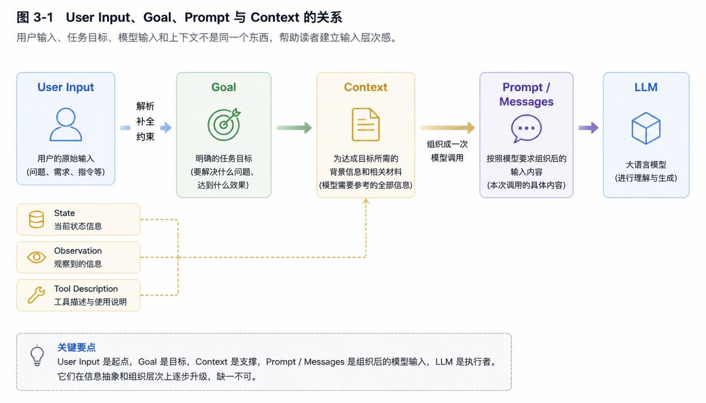
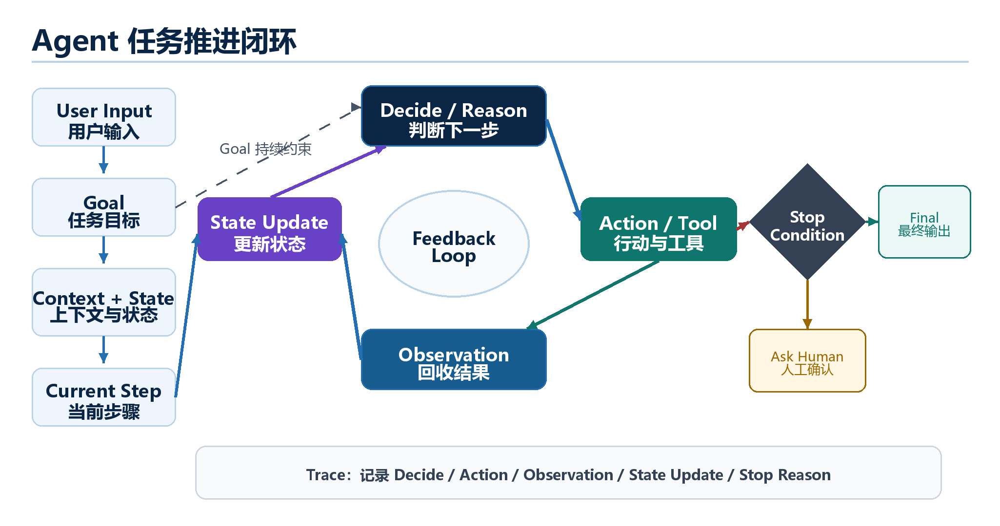

# 第 3 章 任务推进系统：Agent 如何从 Goal 走向结果

*从一次生成到持续推进的系统结构*

**前两章已经把两个前提铺好了：**

- **Agent 不是普通聊天窗口，也不是只会调用 Tool 的模型**；

- **LLM 是 Agent 的能力来源，但 LLM 本身并不等于一个可靠的 Agent**。

- 第二章后面的最小闭环实验已经让我们看到一条线索：**Agent 的关键不只是生成回答，而是围绕 Goal 一轮一轮推进任务**。

**这一章就沿着这条线往下走。我们不急着讲 Memory、RAG、Skill 或 Multi-Agent，那些都是后面的系统模块。本章只回答一个问题：一个 Agent 为什么能从一个目标出发，持续判断下一步、执行下一步、回收结果、更新状态，直到任务完成或需要停止？**

> **阅读提示**
>
> 这一章的概念会比前两章更密一点，但不用紧张。你现在要掌握的不是某个框架的写法，而是任务推进的结构：Goal 给方向，Action 推进一步，Observation 带回结果，State 保持连续，Feedback Loop 让系统继续判断，Stop Condition 让系统知道什么时候该停。

## 3.1 从“生成回答”到“推进任务”

在普通 LLM 调用里，系统通常关注的是一次生成：用户输入一段内容，LLM 生成一个回答，流程就结束了。这里的 LLM 是 Large Language Model，也就是大语言模型；它擅长理解文本、生成文本、做语言层面的推理和概括。**这个能力很重要，但它还不是 Agent 的全部**。

本书中的 Agent，指的是一个**围绕目标运行的系统**：它会根据当前信息判断下一步，必要时调用外部能力，拿到结果后更新状态，再继续判断是否推进或停止。这里第一次出现的 Task Progression，可以理解为“任务推进过程”：系统如何把一个目标拆成若干可执行的判断和动作，并**一步步推向结果**。

不过，在真正推进任务之前，还有一组概念必须先分清：用户说的话、系统整理后的目标、发给模型的 Prompt，以及模型这一轮能看到的 Context，并不是同一个东西。

## 3.2 User Input、Goal、Prompt 与 Context：它们不是一回事

很多 Agent 讨论会把 User Input、Goal、Prompt 和 Context 混在一起说。初看好像差不多，都是“给模型看的东西”；但在系统设计里，它们最好分开理解。分不清这几个概念，后面讲任务推进、模型输入系统和工具调用时都会变得混乱。

| **概念** | **在系统里的含义** | **用新能源汽车分析任务举例** |
| --- | --- | --- |
| **User Input** | 用户原始说出来的话，可能口语化、不完整，也可能带有隐含需求。 | “帮我分析一下新能源汽车行业最近三个月的变化。” |
| **Goal** | 系统从 User Input 中整理出的任务目标，更稳定，用来指导后续推进。 | 整理新能源汽车行业最近三个月的主要变化，并形成结构化分析。 |
| **Context** | 模型当前可见的全部信息环境，包括 User Input、Goal、State、Observation、Tool 描述、历史资料等。 | Goal、已查到的销量资料、政策变化、当前步骤、可用工具说明等。 |
| **Prompt** | 一次发给 LLM 的具体输入文本或消息结构，通常包含指令、目标、状态、输出格式等。 | “你是行业分析助手。任务目标是……当前资料是……请判断下一步……” |

可以把它们的关系理解成一条加工链：User Input 是原材料，Goal 是整理后的任务方向，Context 是这一轮模型能看到的全部信息环境，Prompt 或 Messages 是系统把这些信息组织成一次模型调用的具体形式，有格式要求。



> **先掌握到这里**
>
> 现在不用纠结不同框架里这些词的命名差异。先记住一件事：用户说的话不等于 Agent 的任务目标，任务目标也不等于每一次发给模型的 Prompt。Agent 真正运行时，会把用户输入整理成 Goal，再结合 State、Observation 和 Tool 信息组织成 Context。

把这组关系讲清楚后，我们再看任务是如何被推进的。**Agent 不能只停在 Goal 上，它必须把 Goal 转换成可以执行的路线和步骤**。

## 3.3 Goal 如何变成 Plan 与 Step

Goal 是任务目标，决定 Agent 要往哪里走。但一个 Goal 通常不能直接执行。Context会生成 Plan 和 Step。Plan 可以理解为任务路线，Step 是当前要执行的具体一步。

以新能源汽车行业分析为例，User Input 可能只有一句话，但系统可以整理出一个更清晰的 Context

**示例 3-2：Goal、Plan 与 Step**

```text
User Input:
    帮我分析新能源汽车行业最近三个月的变化。

Context:
    整理新能源汽车行业最近三个月的主要变化，并形成结构化分析+tool+...。

Plan:
    1. 查找销量变化。
    2. 查找政策变化。
    3. 查找价格变化。
    4. 查找电池成本变化。
    5. 汇总结论并输出报告。

Current Step:
    先查找最近三个月销量和价格变化。
```

需要注意，**Plan 不是保证书**。Agent 不一定一开始就拥有完整计划。

更常见的做法是先生成一个粗略路线，然后在每个 Step 执行后，根据新的 Observation 调整下一步。比如查到价格变化远比政策变化更明显时，后续分析就应该把更多注意力放在价格策略、成本变化和车企竞争上。

> **先掌握到这里**
>
> Goal 负责方向，Plan 负责路线，Step 负责当下的一步。不要把 Plan 理解成永远不变的清单；在 Agent 系统里，计划经常会随着 Observation 更新。

当系统知道当前 Step 后，下一件事就是决定要采取什么 Action。

## 3.4 Action：Agent 的下一步到底是什么

Action 是 Agent 在某一轮判断后决定要做的下一步动作。这里要特别注意：**Tool Calling 只是 Action 的一种，不是 Action 的全部**。Tool Calling 指系统让 Agent 请求调用某个外部工具，例如搜索、读取文件、查询数据库或调用业务接口。Tool Calling 是真正执行的动作。Tool 这个词在第一章已经出现过，这里再强调一次：Tool 是系统开放给 Agent 的外部能力，不是 LLM 自带的能力。LLM 本身不会真的上网搜索、读取本地文件或操作数据库；它只能根据 Context 生成一个调用请求或行动建议。**真正执行这个 Action 的，是 Agent 所在的系统**。

| **Action 类型** | **含义** | **例子** |
| --- | --- | --- |
| **继续分析** | 不调用外部工具，只基于已有 Context 推进一步。 | 已有资料足够，先归纳销量变化。 |
| **调用 Tool** | 请求系统执行外部能力。 | 调用 search\_tool 查找最近三个月销量数据。 |
| **追问用户** | 发现目标或约束不清，需要用户补充。 | 询问报告面向投资人还是内部决策。 |
| **请求人工确认** | 动作有风险或影响较大，需要人确认后继续。 | 准备发送报告前，请用户确认收件人。 |
| **输出最终结果** | 判断任务已经满足目标，生成最终回答或报告。 | 生成结构化行业分析。 |
| **停止或暂停** | 遇到边界、失败或缺少权限，不继续自动执行。 | 工具连续失败，提示用户检查数据源。 |

**示例 3-3：一个 Tool Calling 请求**

```text
{
    "type": "tool_call",
    "tool": "search_tool",
    "query": "新能源汽车 最近三个月 销量 价格 政策"
}
```

> **先掌握到这里**
>
> 这段结构不表示 LLM 自己完成了搜索。它只表示模型判断“下一步应该请求搜索工具”。系统收到这个请求后，才会真正执行 search\_tool。

Action 执行完之后，任务还没有结束。系统必须知道这一步产生了什么结果，这就进入了 Observation。

## 3.5 Observation：行动之后必须回收结果

Observation 是一次 Action 执行后返回给系统的结果。它可以来自 Tool，也可以来自用户反馈、文件读取结果、数据库查询结果、网页内容、代码运行结果等。Observation 的关键作用，是把外部世界或执行结果带回 Agent 的下一轮判断中。

这里有一个很重要的技术边界：如果系统没有把 Observation 写回 Context 或 State，LLM 并不会自动知道工具执行结果。**工具返回了结果，不等于模型已经理解了结果**。**系统必须把这些结果组织好**，放进下一轮模型可见的信息环境里。

**示例 3-4：一次搜索后的 Observation**

```text
Observation:
    1. 最近三个月新能源汽车销量波动明显。
    2. 部分地区补贴政策调整。
    3. 多家车企调整车型价格。
    4. 电池成本变化影响整车价格。

Next Context:
    Goal + 当前 State + 以上 Observation + 下一步判断要求
```

> **关键边界**
>
> Observation 不是“模型突然知道了外部信息”，而是系统把行动结果重新组织给模型看。理解这一点，后面讲 Tool、RAG 和 Memory 时就不容易混淆。

Observation 只是一次结果。如果任务要持续推进，系统还需要记录“到目前为止已经发生了什么”。这就是 State。

## 3.6 State：任务为什么能连续

State 是任务推进过程中的当前状态。它记录 Agent 已经知道什么、已经做过什么、下一步可能还缺什么，以及任务是否应该结束。

**没有 State，Agent 每一轮都像重新开始；有了 State，系统才能保持任务连续性**。

**示例 3-5：一个任务内 State**

```text
State:
    Goal: 整理新能源汽车行业最近三个月变化。
    Done:
        - 已查找销量变化。
        - 已查找价格变化。
    Missing:
        - 还需要补充政策变化。
        - 还需要确认电池成本变化。
    Current Step: 查找政策变化。
    Done Flag: False
```

这里要顺手区分一下 State 和 Memory。**State 更偏当前任务内的状态**，例如当前步骤、已完成内容、缺失信息和是否结束。**Memory 更偏跨任务或长期信息**，例如用户偏好、历史项目资料、长期积累的知识。Memory 会在第六章专门展开，现在只要先把 State 理解成“当前任务进度表”就够了。

| **概念** | **关注范围** | **例子** |
| --- | --- | --- |
| **State** | 当前任务内的信息和进度。 | 已经查了销量和价格，还缺政策资料。 |
| **Memory** | 跨任务、长期或可复用的信息。 | 用户长期偏好报告使用三段式结构。 |

> **先掌握到这里**
>
> 现在不要把 State 和 Memory 都塞成“记忆”。State 先理解为当前任务状态；Memory 放到第六章再讲。这样分开后，Agent 的任务连续性会清楚很多。

当系统能记录 State，就可以把 Action、Observation 和下一轮判断连起来，形成 Feedback Loop。

## 3.7 Feedback Loop 与 Stop Condition：循环如何继续，又如何停止

Feedback Loop 是反馈循环，指系统根据上一轮结果更新状态，再进入下一轮判断的结构。它让 Agent 不只是执行一次，而是能根据新的 Observation 调整下一步。Stop Condition 是停止条件，指系统在什么情况下应该结束、暂停或交给人处理。

**伪代码 3-6：最小任务推进循环**

```text
while not should_stop(goal, state):
    context = build_context(goal, state)
    action = llm_decide_next_action(context)
    observation = execute_action(action)
    state = update_state(state, action, observation)

finalize(state)
```

> **先掌握到这里**
>
> 这段伪代码的重点不是语法，而是结构：每一轮都先组织 Context，让 LLM 判断下一步 Action，系统执行 Action，得到 Observation，更新 State，再判断是否继续。

**Stop Condition 不是可有可无的安全装饰**。一个没有停止条件的 Agent 容易无限循环、重复调用工具、消耗成本，甚至在权限不清的情况下继续执行风险动作。**可靠的 Agent 不只要会继续，也要知道什么时候停**。

| **停止条件** | **含义** | **为什么重要** |
| --- | --- | --- |
| **Goal 已完成** | 当前结果已经满足任务目标。 | 避免继续做无意义的补充。 |
| **信息不足** | 无法继续获得必要信息。 | 及时告诉用户缺什么，而不是编造。 |
| **达到最大轮数** | 循环次数超过设定上限。 | 避免无限循环和成本失控。 |
| **工具连续失败** | 外部工具多次返回错误或空结果。 | 避免把工具失败误当成任务结论。 |
| **权限受限** | 当前动作越过系统允许范围。 | 保护数据、账户和业务系统安全。 |
| **需要人工确认** | 动作有风险、不可逆或影响较大。 | 让人参与关键决策，提高可靠性。 |

这里还会牵涉到 Permission Boundary 和 Human-in-the-loop。Permission Boundary 是权限边界，规定 Agent 能做什么、不能做什么。Human-in-the-loop 指人在 Agent 的关键流程中参与确认、判断或接管。它不是 Agent 不够智能的表现，而是可靠系统设计的一部分。

到这里，我们已经有了任务推进的基本零件。下一步要看的是：这些零件在真实系统里有哪些常见组织方式。**ReAct 很经典，但它不是唯一模式**。

## 3.8 常见任务推进模式：Agent 不只有 ReAct

任务推进模式可以理解为 Agent 推动任务的组织方式。不同模式不是互相排斥的流派，而是不同任务条件下的结构选择。简单任务可能只需要 Single-step；目标清楚的任务适合 Plan-and-Execute；信息不完整、需要边查边判断的任务适合 ReAct；高风险任务则需要 Human-in-the-loop。

下面每种模式都按五个维度看：结构、特点、适合场景、缺点或风险，以及确定性边界。确定性边界指的是：哪些步骤是系统预先确定的，哪些地方需要 LLM 或人动态判断。这个维度很重要，因为 **Agent 不是越动态越好**；越关键的业务，越需要清楚**哪些地方不能交给模型随意决定**。

| **模式** | **核心结构** | **主要适合** | **主要风险** |
| --- | --- | --- | --- |
| **Single-step** | 一次输入，一次输出。 | 简单问答、总结、改写。 | 没有持续推进能力。 |
| **Plan-and-Execute** | 先计划，再按步骤执行。 | 目标明确、步骤可拆的任务。 | 初始计划错误会影响后续。 |
| **ReAct** | 判断、行动、观察交替进行。 | 需要边查边判断的任务。 | 容易循环，需要严格停止条件。 |
| **Reflection** | 生成、检查、修订。 | 写作、代码、报告质量提升。 | 可能过度修改或自我确认。 |
| **Workflow + Agentic Decision** | 固定流程中加入动态判断。 | 业务流程、文档处理、运营自动化。 | 流程边界和判断边界容易混。 |
| **Human-in-the-loop** | 关键节点由人确认。 | 高风险、合规、不可逆操作。 | 效率降低，但可靠性更高。 |

> **模式选择不是站队**
>
> 真实系统经常混合使用这些模式。例如资料分析 Agent 可能先 Plan-and-Execute，再在每个资料查找步骤里使用 ReAct，最后用 Reflection 检查报告质量，并在发送或提交前加入 Human-in-the-loop。关键不是记住名字，而是知道每种模式解决什么问题、带来什么风险。

在这些模式里，ReAct 最容易体现 Agent 的闭环特征，所以我们单独再看一下它。

## 3.9 ReAct：一种经典的 Reasoning + Acting 写法

ReAct 是 Reasoning + Acting 的缩写，可以理解为“边判断，边行动”。这里的 Reasoning 不是要求模型把所有内心推理都展示出来，而是指系统让 LLM 根据当前 Context 判断下一步；Acting 是指系统根据模型输出执行 Action，并把结果作为 Observation 收回来。

放到前面的任务推进框架里，ReAct 可以这样理解：Goal 提供任务方向，Current Step 限定当前要推进的部分，Context 提供这一轮判断所需的信息，LLM 做出 Decide / Reason，系统执行 Action，Action 返回 Observation，Observation 更新 State，State 进入下一轮 Context，Feedback Loop 让系统继续判断，Stop Condition 判断是否结束、暂停或交给人处理。

所以，**ReAct 不是脱离前面概念的新模式**，而是前面这些概念在“边做边观察”任务中的一种组织方式。工程实现里也**不应该把 ReAct 简单理解成“让模型展示很多思考文字”**。模型不一定要向用户暴露完整内部推理过程；系统更应该记录可审计的决策摘要、Action 请求、Tool 返回、State 更新和停止原因。

> **不要把 ReAct 神化**
>
> ReAct 是一种经典任务推进写法，但不是 Agent 的唯一形态。它适合边查边判断的任务；如果任务步骤很稳定，Workflow + Agentic Decision 可能更合适；如果任务目标清楚，Plan-and-Execute 可能更直观；如果任务高风险，Human-in-the-loop 必不可少。

下面这个例子里，Goal 不是摆设，它约束每轮判断；Action 不是随便做，而是根据 State 选择出来的；Observation 不是终点，它要进入 State Update；State 让下一轮知道已经做了什么、还缺什么；Feedback Loop 就是 Round 1 到 Round 3 的连续判断；Stop Condition 每轮都在判断是否继续。

**ReAct 的优势是灵活**：每一轮都能根据 Observation 调整下一步。**它的风险也来自灵活**：如果没有 Stop Condition，Agent 可能不断查找；如果没有 Tool 权限边界，它可能请求不该执行的动作；如果没有 Trace，系统出错后很难复盘。

**结构示意 3-7：ReAct 如何使用前面的任务推进概念**

```text
Goal:
    分析新能源汽车行业最近三个月的主要变化，并形成结构化报告。

Current Step:
    收集最近三个月的销量、政策、价格和电池成本变化资料。

Initial State:
    尚未收集资料；需要覆盖销量、政策、价格、电池成本。

Round 1:
    Decide: 当前 State 没有资料，先查销量变化。
    Action: 调用 search_tool，搜索“新能源汽车 最近三个月 销量 变化 数据”。
    Observation: 搜索结果显示，最近三个月销量出现波动。
    State Update: 已有销量线索；仍缺政策、价格、电池成本。
    Stop Check: Goal 尚未完成，继续下一轮。

Round 2:
    Decide: 当前 State 缺政策资料，继续查政策变化。
    Action: 调用 search_tool，搜索“新能源汽车 最近三个月 政策 调整 补贴”。
    Observation: 搜索结果显示，部分地区调整补贴或购车支持政策。
    State Update: 已有销量、政策线索；仍缺价格和电池成本。
    Stop Check: Goal 尚未完成，继续下一轮。

Round 3:
    Decide: 当前 State 缺价格和电池成本资料，继续查找。
    Action: 调用 search_tool，搜索“新能源汽车 最近三个月 价格 调整 电池成本 变化”。
    Observation: 搜索结果显示，多家车企调整价格，电池成本也影响定价。
    State Update: 已有销量、政策、价格、电池成本四类线索。
    Stop Check: 资料维度基本覆盖 Goal，可以进入报告生成阶段。

Final Action:
    基于当前 State 生成结构化行业分析报告。
```



**这里还需要提前认识一个词：Agent Runtime。**

从图上看，Agent 的任务推进像是 Decide、Action、Observation、State Update 之间的循环。但**这个循环不会自动发生**。真实系统中，**需要有一层运行时机制负责把它跑起来**，这一层就是 Agent Runtime。

因此，**Runtime 不是新的智能大脑，也不是某一个 Tool**。它更像 Agent 系统里的执行和控制层：LLM 负责判断，Tool 负责提供外部能力，**Runtime 负责把判断、执行、观察、更新和停止条件连成一个可运行的闭环**。

先掌握到这里即可：第三章先知道它负责“让循环跑起来”；第五章讲 Tool System 时，我们会再详细看 Runtime 如何校验 Tool Call、执行 Tool、处理失败和权限边界。

## 3.10 本章小结：Agent 的核心是任务推进闭环

这一章的核心可以收成一句话：**Agent 的关键不是一次性生成答案，而是围绕 Goal 持续推进任务**。User Input 是用户原始表达，Goal 是系统整理后的任务目标，Prompt 是一次发给 LLM 的具体输入，Context 是模型这一轮可见的全部信息环境。

当 Goal 被拆成 Plan 和 Step 后，Agent 会通过 Action 推进一步，通过 Observation 回收结果，通过 State 保持任务连续，再通过 Feedback Loop 进入下一轮判断。**可靠的 Agent 还必须有 Stop Condition、Permission Boundary 和必要的 Human-in-the-loop**，否则它就可能无限循环、越权执行或在信息不足时强行输出。

**任务推进也不只有 ReAct**。Single-step、Plan-and-Execute、ReAct、Reflection、Workflow + Agentic Decision、Human-in-the-loop 都是常见结构。它们各有适合场景，也各有缺点和风险。做 Agent 系统设计时，**不是选一个名字贴上去**，而是看任务需要多少动态判断、多少固定流程、多少外部工具、多少人工确认。

> **过渡到下一章**
>
> 到这里，我们已经知道 Agent 如何一轮一轮推进任务。但每一轮让 LLM 判断之前，系统都必须把 User Input、Goal、State、Observation、Tool 描述和输出要求组织成模型能理解的输入。这个输入组织过程，就是下一章要讲的模型输入系统：Instruction、Prompt 与 Context 如何组织模型行为。
