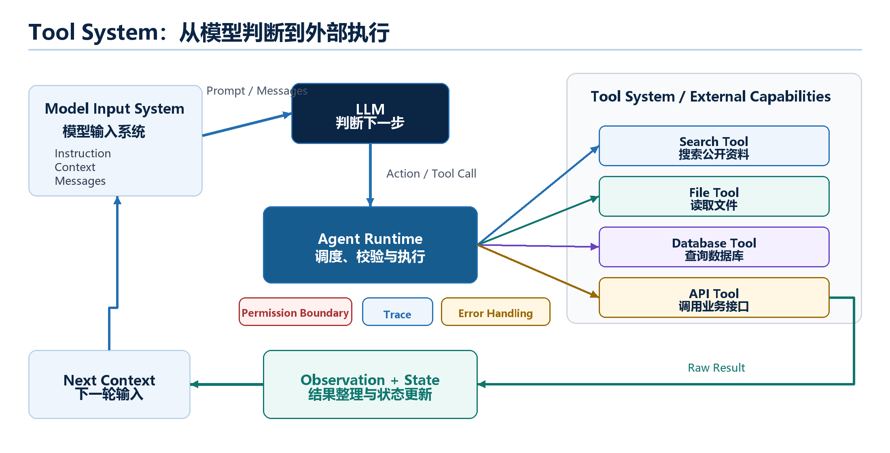

# Chapter 5 - Tool System: How Agents Connect to the Outside World

*From model judgment to controlled external execution*

An LLM can read, generate, and suggest. But by itself, it cannot search the web, read your local files, query a database, send an email, or run tests. To let an Agent affect the outside world, the system needs a Tool System.

This chapter explains how Tools, Tool Descriptions, Tool Calls, Runtime execution, Observations, failures, and Permission Boundaries fit together.

## 5.1 Why Agents Need a Tool System

Many useful tasks require information or actions outside the model:

- Search for current information.
- Read a document.
- Query a database.
- Run code or tests.
- Create a file.
- Send a message.
- Call a business API.

If the Agent cannot use tools, it can only answer from the information already inside the model input. For recent facts, private data, or real execution, that is not enough.

The Tool System solves two problems at once:

1. It gives the Agent access to external capability.
2. It keeps that access controlled by the runtime, not by model self-restraint.

> **Hold This First**
>
> Tool Calling does not mean the model directly operates the world. The model proposes a call. The runtime validates, executes, rejects, records, and returns the result.

## 5.2 Tool, Tool Description, Tool Call, and Observation

These four concepts are often mixed together. Keep them separate.

| Concept | Meaning | Example |
| --- | --- | --- |
| Tool | The actual external capability | A Python function that searches a database |
| Tool Description | The model-facing description of that capability | Name, purpose, arguments, risk level |
| Tool Call | The model's structured request to use the tool | `{"tool_name": "search", "arguments": {...}}` |
| Observation | The result returned after execution | Search results, file contents, error message |

The Tool is real executable capability. The Tool Description is only the model's map of that capability. The Tool Call is only a request. The Observation is the result returned to the Agent loop.

This distinction is important because safety control belongs to the runtime. Even if the model outputs a Tool Call, the runtime may reject it.

## 5.3 From Model Judgment to System Execution: How a Tool Is Called

A minimal Tool Calling flow looks like this:



1. The runtime assembles the model input, including Goal, State, recent Observations, and Tool Descriptions.
2. The LLM decides that it needs an external capability.
3. The LLM outputs a Tool Call.
4. The runtime parses the Tool Call.
5. The runtime checks whether the tool exists.
6. The runtime validates arguments against the schema.
7. The runtime checks permission and risk.
8. The runtime executes the tool or rejects the call.
9. The result becomes an Observation.
10. The Observation updates State and may enter the next Context.

The LLM participates in the decision. The runtime owns execution.

## 5.4 How Tool Results Return to Context

Tool output should not be blindly appended to the next model input. Raw results may be long, noisy, irrelevant, or unsafe. The system should turn raw results into Observations.

For example:

```json
{
  "tool_name": "search_industry_news",
  "raw_result": "...long search output...",
  "observation": {
    "topic": "sales changes",
    "summary": "Recent monthly deliveries fluctuated, with growth slowing in some months.",
    "source": "public_search",
    "confidence": "medium"
  }
}
```

The Observation can then update State:

```json
{
  "done": ["sales changes"],
  "missing": ["policy changes", "price changes", "battery cost changes"]
}
```

Only relevant, summarized, and labeled information should enter the next Context. This protects the Agent from context bloat and prompt injection.

## 5.5 Tool Failure and Permission Boundary

Tools fail. A reliable Agent must expect failure.

Common Tool Failures include:

- Tool not found.
- Invalid arguments.
- Empty results.
- Timeout.
- Network failure.
- Permission denied.
- Rate limit.
- Unsafe request.

Failure is also an Observation. It should be recorded and used in the next decision. For example, the Agent may retry with a different query, ask the user, or stop.

Permission Boundary is the rule layer that controls which tools may be executed automatically and which require confirmation.

| Tool type | Example | Suggested control |
| --- | --- | --- |
| Low-risk read-only | Search public web | Usually allow |
| Private read | Read internal documents | Check access scope |
| Write action | Create or modify files | Validate target path |
| External side effect | Send email, purchase item | Require user confirmation |
| High-risk operation | Change permissions, delete data | Block or require strict approval |

> **Key Boundary**
>
> Tool Description can tell the model when not to use a tool. But safety cannot depend only on the model being careful. The runtime must enforce permission.


## 5.6 Chapter Summary: Tool System Is the Agent's Execution Layer

The Tool System connects the Agent to the outside world. It includes:

- Tool Registry: what tools exist.
- Tool Description: what the model can see.
- Tool Call: the model's structured request.
- Runtime validation: whether the call is legal and safe.
- Tool execution: the actual external operation.
- Observation: the result returned into the Agent loop.
- Permission Boundary: which actions are allowed, confirmed, or blocked.

The most important lesson is:

**The model can propose. The runtime must decide and execute.**

Once this boundary is clear, Tool Calling becomes a controlled engineering mechanism rather than a vague claim that "the model can use tools."
