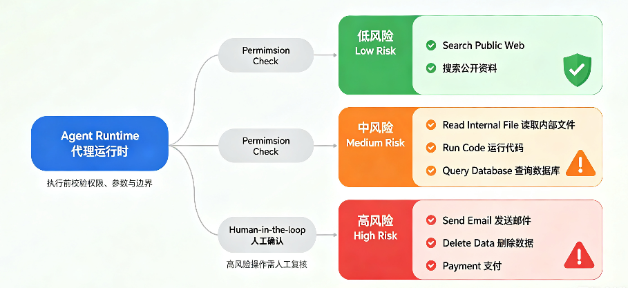

# 第 5 章 Tool System：Agent 如何连接外部世界

*从模型判断到系统执行，理解工具调用的边界、链路与安全控制*

第四章讨论的是模型输入系统：Instruction、Prompt、Context 和 Messages 如何让 LLM 在每一轮看见合适的信息。这里的 LLM 是 Large Language Model，也就是大语言模型。它能根据输入判断、生成和推理，但**它自己并不会真正搜索网页、读取文件、查询数据库或修改业务系统**。

第五章要接上另一个问题：当 LLM 判断“下一步需要查资料”或“下一步需要调用某个能力”时，Agent 如何把这个判断变成真实动作？**答案不是“让模型自己执行”，而是通过 Tool System**。**Tool System 是 Agent 中负责管理外部能力的一整套机制**，包括工具说明、工具选择、工具调用、参数校验、权限控制、执行调度、结果回收和错误处理。

> ****阅读提示****
>
> 这一章先不放完整代码实例。我们只把 Tool System 的概念边界和执行链路讲清楚。现在先掌握：**LLM 负责判断，Tool 负责外部能力，Agent Runtime 负责调度、执行和安全控制**。

## 5.1 为什么 Agent 需要 Tool System

如果 Agent 只能调用 LLM，它最多是在已有输入里理解、生成和整理。它可以写总结、改文本、提出建议，但不能主动拿到新的外部信息，也不能对真实系统产生影响。**很多任务之所以需要 Agent，不是因为它要说更多话，而是因为它要在任务过程中连接外部世界**。

Tool 在本书中指 Agent 系统可以调用的外部能力。它可以是搜索工具、文件读取器、数据库查询、代码执行器、浏览器操作、企业内部 API，或者发送邮件、提交审批这样的业务动作。第一次看到 Tool 时，先把它理解成“**系统开放给 Agent 使用的能力接口**”，而不是普通意义上的软件工具图标。

**Tool System 则不是某一个工具，而是围绕这些 Tool 建立起来的管理和执行机制**。它要回答一组工程问题：有哪些工具可以用？模型怎么知道工具能做什么？模型提出调用后谁来执行？参数是否合法？权限是否允许？失败怎么办？结果如何回到下一轮 Context？

| **角色** | **主要职责** | **边界** |
| --- | --- | --- |
| **LLM** | 根据当前 Context 判断下一步 Action，必要时提出 Tool Call。 | 不直接执行外部动作，也不应该绕过系统权限。 |
| **Tool** | 提供真实外部能力，例如搜索、读文件、查数据库、运行代码。 | 只负责执行被允许的具体能力，不负责理解整个任务目标。 |
| **Agent Runtime** | 解析模型输出、校验 Tool Call、执行 Tool、记录 Trace、更新 State。 | 是工具调用链路的调度层和安全控制层。 |
| **Tool System** | 管理工具描述、注册、调用、权限、结果回写和失败处理。 | 不是单个函数，而是一整套执行层机制。 |

> ****先掌握到这里****
>
> **Agent 不是让 LLM 自己去操作外部世界**。更准确的结构是：LLM 判断下一步，**Runtime 按规则执行或拒绝，Tool 提供真实能力，Observation 把结果带回下一轮任务**。

**插图 5-1：Tool System 在 Agent 中的位置**

> ****图中要表达什么：**展示 Tool System 如何把 LLM 的判断连接到外部能力，同时由 Agent Runtime 负责执行和安全控制。**
>
> **图中包含哪些元素：**左侧为模型输入系统，包含 Instruction、Context、Messages。中间为 LLM，输出 Action 或 Tool Call。LLM 下方连接 Agent Runtime，Runtime 右侧连接多个 Tool，例如 Search Tool、File Tool、Database Tool、API Tool。Tool 返回 Observation，再回到 State 和下一轮 Context。Runtime 外侧标注 Permission Boundary、Trace 和 Error Handling。
>
> ***生图提示：****一张简洁专业的 Agent 架构信息图，浅色背景。左侧是模型输入系统 Instruction、Context、Messages，中间是 LLM，向下连接 Agent Runtime。Runtime 右侧连接 Search Tool、File Tool、Database Tool、API Tool 等工具节点。工具结果以 Observation 回到 State 和下一轮 Context。Runtime 外侧放置 Permission Boundary、Trace、Error Handling 标签。技术书籍风格，不使用卡通机器人，不使用复杂科技背景。*

## 5.2 Tool、Tool Description、Tool Call 与 Observation

进入 Tool System 后，最容易混淆的是四个词：Tool、Tool Description、Tool Call 和 Observation（此语境下）。**它们在一条链路上，但不是同一件事**。如果这四个边界不清楚，后面讲工具执行、权限和失败处理都会变得混乱。

| **概念** | **含义** | **容易混淆的点** |
| --- | --- | --- |
| **Tool** | 真实可执行的外部能力，例如 search\_tool、read\_file\_tool、database\_query\_tool。 | Tool 是系统侧能力，不是模型脑子里的想象。 |
| **Tool Description** | 写给 LLM 看的工具说明，告诉模型工具能做什么、何时使用、需要哪些参数。 | 它是说明书，不是工具本身。 |
| **Tool Call** | LLM 根据 Tool Description 生成的调用请求，通常包含工具名和参数。 | Tool Call 不等于工具已经执行。 |
| **Observation** | Tool 执行后返回给 Agent 的结果，经过整理后会进入下一轮 Context。 | Observation 不等于原始返回；它通常需要筛选、摘要和标记来源。 |

以新能源汽车行业分析任务为例，系统里可能真的有一个 search\_tool，它能搜索外部资料。**LLM 不需要知道 search\_tool 背后的代码实现，它需要看到的是 Tool Description**：这个工具用于搜索公开资料，适合在当前 Context 缺少事实、数据或最新信息时使用，调用时需要提供 query、time\_range 等参数。

当 LLM 判断当前 State 中缺少政策变化资料时，**它不会自己搜索网页，而是输出一个 Tool Call**，例如请求调用 search\_tool，并提供“新能源汽车 最近三个月 政策 调整”这样的查询词。**随后由 Agent Runtime 校验这个请求，真正执行 search\_tool**。工具返回结果后，系统把结果整理成 Observation，再放回下一轮 Context。

> ****先掌握到这里****
>
> 这四个词可以按顺序记：Tool Description 让 LLM 知道工具，Tool Call 是模型提出调用请求，Runtime 执行真正的 Tool，Tool 返回的结果被整理成 Observation。**不要把 Tool Call 当成工具已经执行，也不要把 Tool Description 当成工具本身**。

## 5.3 从模型判断到系统执行：Tool 是如何被调用的

上一节把四个概念拆开了，这一节看它们如何串成完整链路。这里需要引入 Agent Runtime。**Agent Runtime 可以理解为 Agent 的运行时调度层**。

它不一定亲自实现所有细节，而是**负责把一轮任务循环串起来**：调用输入组装模块（Context Assembly）准备 Prompt 或 Messages，调用 LLM 获得判断结果，把模型输出交给解析模块，必要时调度 Tool Executor 执行工具，把结果整理成 Observation，更新 State，记录 Trace，并判断是否进入下一轮。

**Tool System 则是 Agent Runtime 在处理工具相关 Action 时使用的一套机制**。它负责管理可用 Tool，向 LLM 提供 Tool Description，定义参数 Schema，解析和校验 Tool Call，检查权限边界，执行真正的 Tool，并把工具结果整理成 Observation。

其中，**Schema 是参数结构约束，用来规定工具输入应该长什么样**。比如一个搜索工具可能要求输入必须包含 query 字段，query 必须是字符串；也可能要求 time\_range 只能是“最近一周”“最近一个月”“最近三个月”这类允许值。

**还记得前面章节有个循环图吗？工具是可能在plan中按需调用的，一次调用流程如下：**

| **步骤** | **Tool Call 的完整执行链路，一次具体的工具调用请求** |
| --- | --- |
| **Step 1** | Context Assembly 把当前 Goal、State、Observation、Tool Description 和输出约束组装进模型输入。 |
| **Step 2** | LLM 根据当前 Context 判断下一步 Action。如果需要外部能力，就生成 Tool Call。 |
| **Step 3** | Tool System解析 Tool Call，检查工具名是否存在、参数格式是否符合 Schema、权限是否允许。Schema 是参数结构约束，用来规定工具输入应该长什么样。 |
| **Step 4** | 校验通过后，Tool System执行真正的 Tool。校验失败时，Tool System可以拒绝、要求重试、请求用户确认或触发 Stop Condition。 |
| **Step 5** | Tool 返回结果或错误。Runtime 把结果整理成 Observation，并记录到 Trace。 |
| **Step 6** | Observation 更新 State，并由 Context Assembly 决定下一轮让 LLM 看见哪些信息。 |

> **这条链路说明了 Tool System 的核心价值：它把模型的语言判断转成系统可执行动作，同时把动作控制在可审计、可校验、可停止的范围内。**

## 5.4 Tool 的结果如何回到 Context

**Tool 执行完以后，任务还没有结束**。工具返回结果（Raw Result）只是外部世界给系统的一次回应。LLM 下一轮能不能利用这个结果，**取决于系统是否把它整理成 Observation，并在下一轮 Context Assembly 中放回模型输入**。

**Raw Result 是 Tool 返回的原始结果，应该被当作外部资料，而不是新的系统指令**。**它通常不会直接进入 Prompt 或 Messages**，而是先经过 Observation Builder，也就是结果整理层。为什么要经过整理层呢？一是因为：

**Observation Builder 会根据当前 Goal 和 Step，对 Raw Result 做相关性筛选、时间过滤、去重、摘要、结构化提取、来源标注和安全处理**。

整理后的结果会变成 Observation，并写回 State。下一轮 Context Assembly 再根据 Context Window、当前任务重点和信息优先级，决定哪些 Observation 应该进入 Messages。这样，**模型看到的是经过筛选和标注的资料，而不是未经处理的外部原文**。

这里要区分三个层次：Raw Result、Observation 和 Context。Raw Result 是工具返回的原始结果，例如搜索工具返回的十条网页摘要、数据库查询返回的表格、文件读取返回的长文本。Observation 是系统整理后的可用结果，例如保留关键事实、来源、时间、置信度和不确定性说明。Context 是下一轮 LLM 实际能看到的信息环境，**Observation 只是 Context 的一部分**。

| **层次** | **它是什么** | **系统要做什么** |
| --- | --- | --- |
| **Raw Result** | Tool 返回的原始内容，可能很长、重复、无关或带噪声。 | 先不要直接全量塞给 LLM。 |
| **Observation** | 系统整理后的行动结果，能说明这一步获得了什么、是否可靠、还缺什么。 | 摘要、去重、标记来源、保留关键字段、标出不确定性。 |
| **Context** | 下一轮模型实际看到的信息环境，包含 Goal、State、相关 Observation、约束和必要资料。 | 由 Context Assembly 选择、压缩、排序后放进 Prompt 或 Messages。 |

> ****先掌握到这里****
>
> **Tool 返回结果不等于模型已经理解结果**。**系统必须先把 Raw Result 整理成 Observation**，再由 Context Assembly 决定下一轮放多少、怎么放、放在哪里。这个过程连接了第四章的模型输入系统和第五章的 Tool System。

## 5.5 Tool Failure 与 Permission Boundary

一个可靠的 Agent 不能假设工具永远成功。Tool Failure 指工具调用失败或返回不可用结果的情况。它可能来自工具不存在、参数错误、权限不足、网络超时、返回为空、结果太长、结果冲突，或者外部服务本身不可用。**工具失败不是任务失败，它是一个 Observation**，**系统需要据此决定重试、换工具、请求用户补充、降级处理或停止**。

| **失败类型** | **可能原因** | **合理处理方式** |
| --- | --- | --- |
| **工具不存在** | 模型生成了未注册的工具名，或工具配置被移除。 | Runtime 拒绝执行，提示模型重新选择可用 Tool。 |
| **参数错误** | 缺少必填字段、格式不符合 Schema、查询词过宽或过窄。 | 要求模型修正参数，或由系统补全可确定字段。 |
| **权限不足** | 当前用户、任务或环境不允许访问该 Tool。 | 拒绝执行，必要时请求用户确认或管理员授权。 |
| **返回为空** | 查询条件不合适、数据源没有结果、外部服务异常。 | 调整查询、换数据源，或向用户说明信息不足。 |
| **结果不可信** | 来源冲突、时间过旧、外部内容可疑。 | 标记不确定性，继续核实，不直接当成事实。 |
| **工具超时** | 网络或服务响应太慢，超过系统设定成本。 | 重试有限次数，超过上限后触发 Stop Condition。 |

Permission Boundary 是权限边界，规定 Agent 可以调用哪些 Tool、在什么条件下调用、哪些动作必须经过用户或系统确认。它和 Tool Failure 可以放在同一节理解，因为它们都属于工具系统的可靠性边界。**失败处理解决“工具没按预期工作怎么办”，权限边界解决“即使模型想做，系统是否允许做”**。

**低风险 Tool：**搜索公开资料、读取公开文档、格式转换等。通常可以自动执行，但仍要记录 Trace。

**中风险 Tool：**读取内部文件、查询数据库、运行代码、访问业务 API。需要身份、范围和参数校验。

**高风险 Tool：**发邮件、删除文件、支付、提交审批、修改生产数据。通常需要 Human-in-the-loop，也就是人在关键节点参与确认或接管。

Tool Description 可以提醒 LLM 什么时候不要使用某个工具，但**不能只靠模型自觉。真正的安全控制必须由 Runtime 执行**。比如 send\_email\_tool 的说明可以写“只有用户确认收件人和正文后才能发送”，但如果模型在没有确认的情况下发起共聚调用申请，**Runtime 仍然必须拦截**。

> ****可靠系统的判断****
>
> **工具系统越接近真实业务，越不能把安全交给提示词**。Tool Description 负责让模型理解工具，**Permission Boundary 负责系统层面强制执行规则**。两者配合，Agent 才能既有能力，又不越界。

## 5.6 本章小结：Tool System 是 Agent 的执行层

第四章的模型输入系统解决“LLM 每一轮看见什么”；第五章的 Tool System 解决“Agent 如何把模型判断变成外部动作”。**没有 Tool System，Agent 很容易停留在生成文本**；**有了 Tool System，Agent 才能搜索、读取、查询、计算、调用业务系统，并把外部结果带回任务循环**。

但 **Tool System 的关键不是“工具越多越好”**。工具越多，选择难度、权限风险、失败路径和调试成本都会上升。**好的 Tool System 更看重工具边界是否清楚、Tool Description 是否准确、参数 Schema 是否稳定、Runtime 是否校验、Observation 是否整理、失败是否可处理、权限是否可控**。

**这一章名词引入很多，后面章节也会出现，需要好好理解。**

| **边界** | **本章结论** |
| --- | --- |
| **Tool 不等于 Tool Description** | Tool 是真实能力，Tool Description 是给 LLM 看的接口说明。 |
| **Observation 不等于原始返回** | Observation 是整理后的工具结果，会影响下一轮 Context。 |
| **Tool Failure 不是任务失败** | 失败也是 Observation，系统可以重试、换工具、询问用户或停止。 |
| **权限不能只靠模型自觉** | Permission Boundary 必须由 Runtime 强制执行。 |
