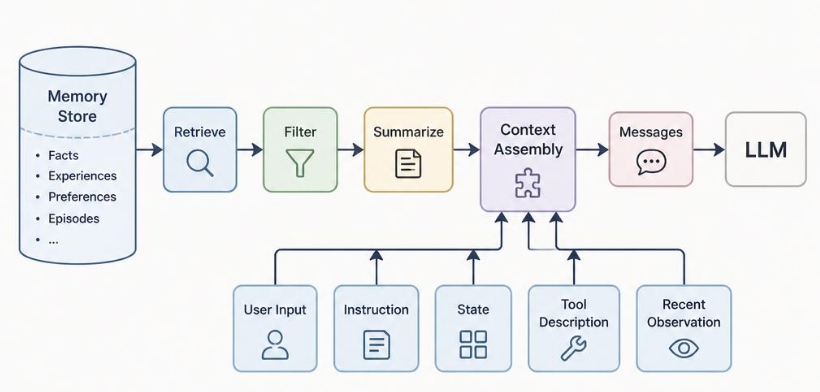

# Chapter 6 - Memory System: State, Memory, and Task Continuity

*Why an Agent can continue a task instead of starting from scratch each round*

An Agent needs continuity. It must know what has already happened, what information has been collected, what is still missing, and which user preferences or reusable facts should carry forward.

This chapter separates three concepts that are often mixed together: **State, Memory, and Context**.

## 6.1 Why Agents Need a Memory System

Without continuity, every model call is isolated. The Agent may repeat the same search, forget what the user already confirmed, lose intermediate results, or contradict earlier decisions.

The Memory System helps with:

- Current task progress.
- User preferences.
- Reusable procedures.
- Past decisions.
- Retrieved facts.
- Long-running task continuity.

But "memory" does not mean saving everything forever. Bad memory creates noise, privacy risk, and persistent errors.

> **Hold This First**
>
> A useful Memory System is selective. It decides what to write, what to retrieve, what to update, and what to forget.

## 6.2 State, Memory, and Context: Do Not Mix Them Together

| Concept | Main question | Lifetime |
| --- | --- | --- |
| State | Where is the current task now? | Current task or run |
| Memory | What reusable information should persist? | Across rounds or tasks |
| Context | What does the model see in this call? | One model call |

State is the task ledger. Memory is reusable stored information. Context is the selected input for the current model call.

They interact, but they are not the same:

```text
State + Retrieved Memory + Tool Observations + Instructions
        -> Context Assembly
        -> Model Input
```

## 6.3 State: The Runtime Ledger of the Current Task

State records the current task. For a data analysis Agent, State may contain:

```json
{
  "goal": "Analyze recent changes in the new-energy vehicle industry",
  "done": ["sales changes"],
  "missing": ["policy changes", "price changes", "battery cost changes"],
  "observations": [],
  "trace": [],
  "final_answer": null
}
```

State is usually updated after each Action and Observation. It answers:

- What is the Goal?
- What has been completed?
- What information is missing?
- What Observations have been collected?
- What is the next likely step?
- Is the task done?

State should be explicit. If State only lives implicitly inside the model's generated text, the system cannot reliably inspect, validate, or resume the task.



## 6.4 Memory: Not Everything Should Be Put into a Database

Memory is information that may be reused beyond the immediate step. It can help the Agent adapt to the user, avoid repeating setup, and apply known procedures.

However, Memory is not a full chat log dump. Saving everything creates several problems:

- The Agent retrieves too much irrelevant information.
- Private data may be retained unnecessarily.
- Wrong conclusions may keep influencing later work.
- Old preferences may override newer user intent.
- Context becomes noisy and expensive.

A good Memory System has a write policy, retrieval policy, update policy, and forgetting policy.

## 6.5 Common Types of Memory

| Memory type | What it stores | Example |
| --- | --- | --- |
| User preference | Stable user choices | "Reports should start with conclusions." |
| Project memory | Project-specific facts | "This repo uses pytest and pnpm." |
| Procedural memory | Reusable ways of doing work | "For industry analysis, compare sales, policy, price, and cost." |
| Episodic memory | Past interaction summaries | "Last time the user asked for a compact report." |
| Knowledge memory | Reusable factual material | "This dataset contains monthly sales records." |

Not every system needs all types. Start with the minimal memory that improves the task.

## 6.6 Memory Write: What Should Be Remembered

Memory Write is the decision to store information. It should be selective.

Good candidates:

- Explicit user preferences.
- Stable project facts.
- Reusable procedures.
- Confirmed decisions.
- Information likely useful in future tasks.

Poor candidates:

- One-time temporary details.
- Sensitive information without need.
- Unverified claims.
- Long raw text that should be indexed as knowledge instead.
- Contradictory data without resolution.

The Agent should not silently store everything. Some memories may require user consent or policy checks.

## 6.7 Memory Retrieval: How Memory Returns to Context

Memory Retrieval means selecting relevant memory for the current task. It is not the same as loading all memory.

Retrieval may use:

- Keywords.
- Tags and scopes.
- User or project identifiers.
- Time filters.
- Embeddings and semantic similarity.
- Permission filters.
- Recency and confidence scores.

The retrieved memory then enters Context Assembly. The model should see only the memory relevant to the current Step.

Example:

```text
Goal: write an industry analysis report.
Retrieved Memory:
- [user_preference] Start reports with conclusions, then evidence, then recommendations.
- [procedural_memory] Analyze sales, price, policy, and cost dimensions.
```

## 6.8 Memory Update and Forgetting: Memory Also Needs Maintenance

Memory can become stale. User preferences change. Project facts change. Old observations may be wrong. Therefore memory needs update and forgetting.

Common update actions:

- Replace old preference with newer preference.
- Increase confidence after confirmation.
- Lower confidence after contradiction.
- Merge duplicates.
- Mark a memory as expired.
- Delete memory that should not be retained.

Forgetting is not a failure. It is part of keeping the system clean and safe.

## 6.9 Memory Risks: Privacy, Pollution, and Error Carryover

Memory introduces risk.

**Privacy risk:** Sensitive user or business information may be stored longer than needed.

**Pollution risk:** Malicious or irrelevant information may be written into memory and later influence the Agent.

**Error carryover:** A wrong fact may persist and cause repeated wrong answers.

**Over-personalization:** The Agent may overfit to past preferences and ignore the current request.

Controls include:

- Explicit write policies.
- User consent for sensitive memory.
- Source and confidence metadata.
- Expiration and deletion.
- Retrieval filters.
- Human review for high-risk memory.

## 6.10 Chapter Summary: Memory System Is Infrastructure for Task Continuity

This chapter's core boundary is:

**State tells the Agent where the current task is. Memory stores reusable information. Context is what the model sees this round.**

A reliable Memory System decides:

- What to store.
- What not to store.
- How to retrieve relevant memory.
- How memory enters Context.
- When to update, expire, or delete memory.
- How to protect privacy and prevent pollution.

The goal is not to remember everything. The goal is to remember the right things and use them at the right time.
