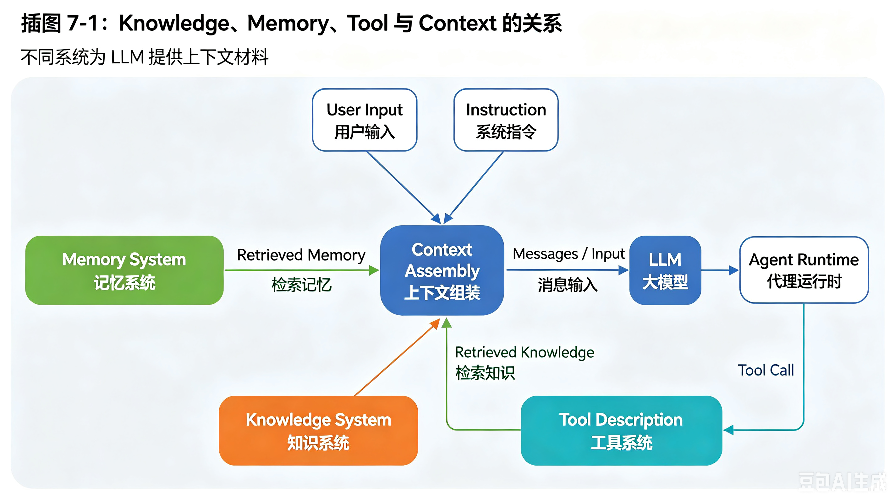

# Chapter 7 - Knowledge System: How RAG Lets Agents Work with External Materials

*Grounding Agent answers in documents, search results, and external sources*

An LLM's internal knowledge is not enough for many Agent tasks. The task may require current information, private documents, source-grounded answers, or long materials that cannot fit into the model input.

This is where the Knowledge System comes in. The most common pattern is RAG: Retrieval-Augmented Generation.

## 7.1 Why Agents Need a Knowledge System

Without a Knowledge System, the Agent may answer from memory, guess missing facts, or rely on stale model knowledge. For tasks like research, legal review, customer support, enterprise Q&A, and technical documentation, that is not acceptable.

A Knowledge System helps the Agent:

- Find relevant external material.
- Read long documents in pieces.
- Ground answers in sources.
- Reduce hallucination.
- Support citation and audit.
- Work with private or domain-specific knowledge.

## 7.2 What RAG Means: Retrieve First, Then Generate from Material

RAG stands for Retrieval-Augmented Generation. The basic flow is:

```text
User question
  -> retrieve relevant material
  -> assemble retrieved material into context
  -> LLM generates answer grounded in that material
```

The LLM is still used, but it is no longer expected to answer only from internal knowledge. It reads retrieved sources and generates an answer based on them.

> **Hold This First**
>
> RAG is not "put a database beside the model." It is a pipeline that retrieves material, places it into context, and asks the model to answer with grounding.



## 7.3 Relationship Among Knowledge System, Memory System, Tool System, and Context

These systems overlap, but they solve different problems.

| System | Main responsibility |
| --- | --- |
| Knowledge System | Retrieve external material for grounding |
| Memory System | Store reusable task/user/project information |
| Tool System | Execute external capabilities |
| Context Assembly | Decide what enters the model input this round |

Knowledge retrieval can also be exposed as a Tool. For example, the Agent may call `retrieve_policy_docs(query)` as one Action. The retrieved snippets then become Observations or Context material.

## 7.4 From Documents to a Knowledge Base: RAG Starts with Organizing Material

Before retrieval can work, documents must be prepared. This may include:

- Collecting source files.
- Extracting text from PDF, Word, HTML, or databases.
- Cleaning headers, footers, duplicates, and broken text.
- Preserving source metadata.
- Splitting documents into chunks.
- Building indexes.

Bad preparation produces bad retrieval. If the source text is messy, missing, or poorly chunked, the model may never receive the evidence it needs.

## 7.5 Chunk: Why You Cannot Put the Whole Document into the Model

A Chunk is a smaller segment of a larger document. We chunk documents because:

- Whole documents may exceed the Context Window.
- Retrieval needs smaller comparable units.
- The model usually needs only a relevant passage, not the entire file.
- Smaller chunks allow citations to be more precise.

Chunking is a design choice. Chunks that are too small lose context. Chunks that are too large retrieve irrelevant material. Good chunking respects document structure: headings, sections, paragraphs, tables, and semantic boundaries.

## 7.6 Embedding: Turning Questions and Text into Comparable Semantic Representations

Embedding means converting text into vectors that represent semantic meaning. The system can embed both the user's query and document chunks, then compare them by vector similarity.

Example:

```text
Question: "What changed in battery costs recently?"
Chunk A: "Lithium carbonate prices declined..."
Chunk B: "A company launched a new SUV..."
```

The embedding system should rank Chunk A as more relevant.

Embedding is useful, but it is not perfect. Similarity is not the same as truth. Retrieved chunks still need filtering, ranking, and grounding checks.

## 7.7 Index and Retrieval: How Material Is Found

An Index stores searchable representations of the material. Retrieval uses the query to find relevant chunks.

Common retrieval approaches:

- Keyword search.
- Vector search.
- Hybrid search.
- Metadata filtering.
- Reranking.

The retrieval result usually contains chunks plus metadata:

```json
{
  "source": "industry_report_2026_q2.pdf",
  "page": 12,
  "text": "Battery raw material prices declined during Q2...",
  "score": 0.84
}
```

The Agent can then decide which results enter Context.

## 7.8 Retrieval Is Not Only Top-K: Filtering, Rewriting, Hybrid Search, and Rerank

Naively taking the top 5 vector matches is often not enough. Better retrieval may include:

- Query rewriting: turn the user's wording into better search queries.
- Metadata filtering: restrict by date, source, department, permission, or document type.
- Hybrid retrieval: combine keyword and vector search.
- Reranking: use a stronger model to reorder candidate results.
- Deduplication: remove repeated chunks.
- Source diversity: avoid all results coming from one document.

Good retrieval is an engineering system, not a single function call.

## 7.9 How Retrieved Knowledge Enters Context

Retrieved Knowledge should enter Context with clear boundaries:

```text
Source 1: industry_report_q2.pdf, page 12
Relevant excerpt:
...

Source 2: policy_update.html, published 2026-06-18
Relevant excerpt:
...
```

The model should be instructed to answer based on the sources and to say when the sources are insufficient.

Retrieved Knowledge should not be treated as instruction. It is evidence, not a command.

## 7.10 Why RAG Needs Grounded Answer

A Grounded Answer is an answer supported by retrieved material. It should:

- Use the retrieved evidence.
- Avoid unsupported claims.
- Mention uncertainty when evidence is weak.
- Cite or point to sources when needed.
- Refuse to invent facts not present in the material.

This is especially important in Agent tasks because the output may drive later actions. A wrong grounded-looking answer can pollute State, Memory, or downstream decisions.

## 7.11 RAG Failure Modes: Why Retrieval Can Still Produce Wrong Answers

RAG can fail even when it retrieves material.

Common failures:

- Wrong chunks retrieved.
- Relevant chunks missing.
- Chunk lacks surrounding context.
- Model ignores source material.
- Model overgeneralizes from one source.
- Source is outdated or low quality.
- Citations do not support the claim.
- Conflicting sources are not resolved.

RAG reduces hallucination risk, but it does not eliminate the need for evaluation.

## 7.12 How Agents Use RAG: Knowledge Retrieval Can Be a Tool

For an Agent, retrieval can be an Action:

```json
{
  "type": "tool_call",
  "tool_name": "retrieve_knowledge",
  "arguments": {
    "query": "new-energy vehicle battery cost changes last three months",
    "time_range": "last three months"
  }
}
```

The Knowledge System returns Observations:

```json
{
  "topic": "battery cost changes",
  "sources": [
    {"title": "Q2 battery material report", "excerpt": "..."}
  ],
  "summary": "Battery raw material prices changed in a way that affected vehicle margins."
}
```

The Observation updates State and enters the next Context. This connects RAG to the Agent loop.


## 7.13 Chapter Summary: Knowledge System Gives Agents Evidence

The Knowledge System lets an Agent work with external material instead of relying only on model memory.

The RAG pipeline includes:

- Document preparation.
- Chunking.
- Embedding.
- Indexing.
- Retrieval.
- Filtering and reranking.
- Context assembly.
- Grounded answer generation.
- Evaluation.

For Agents, Knowledge Retrieval is often a Tool. The Agent calls it, receives Observations, updates State, and uses the evidence in later steps.

The goal is not just to retrieve text. The goal is to make the Agent's answer and action grounded in reliable material.
