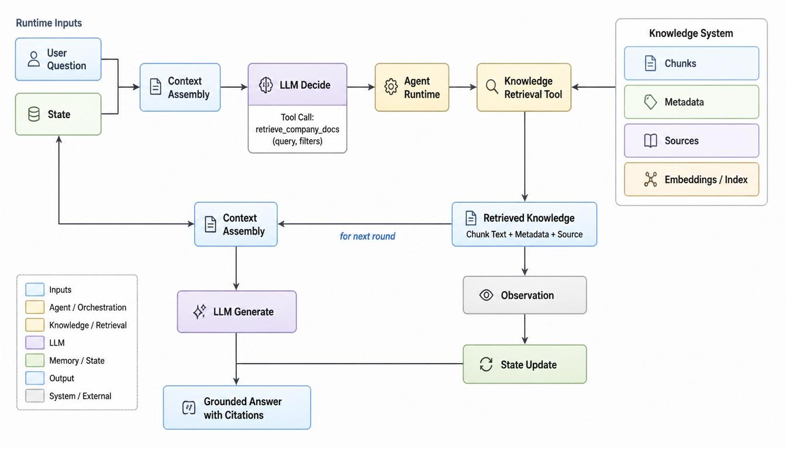

# 第 7 章  Knowledge System：RAG 如何让 Agent 基于外部资料工作

*从文档整理、Embedding、Retrieval 到 Grounded Answer，把知识依据放进 Agent 循环*

到第六章为止，我们已经把 Agent 的几条核心链路逐步铺开了：Tool System 让 Agent 能连接外部能力，Memory System 让 Agent 能保存和取回任务相关信息，Context Assembly 负责把每一轮 LLM 需要看的内容组装起来。第六章后的实验还开始接入真实 API，让模型不再只是被规则模拟。

继续往前走，讨论另一个非常常见的问题：如果 Agent 要基于一批外部资料工作，比如产品手册、公司制度、政策文件、合同、论文、行业报告或内部知识库，它应该怎么做？**这个问题不能只靠 LLM 自身知识解决，也不能把所有文档直接塞进 Prompt。我们需要 Knowledge System。**

Knowledge System 可以理解为 Agent 的知识系统。**它负责管理外部资料，让系统能够解析资料、整理资料、检索相关片段，并把这些片段放进本轮 Context**，使 LLM 基于资料回答和推进任务。**这里的知识不是模型永久学会的参数知识，而是模型外部、由系统管理的资料依据。**

> **阅读提示**
>
> 本章会出现几个新词：RAG、Chunk、Embedding、Index、Retrieval、Rerank、Grounded Answer。先不用把它们当成一堆孤立技术，它们都围绕一个问题展开：Agent 如何从外部资料里找到可靠依据，并把依据放进本轮 Context。
>
> 先掌握到这里：**Knowledge System 管外部资料，Memory System 管任务记忆和用户偏好；二者都不会自动进入 LLM，都要经过检索、筛选和 Context Assembly。**

## 7.1 为什么 Agent 需要 Knowledge System

很多真实任务不是单纯靠模型生成就能完成的。比如问公司报销制度、产品接口参数、某份合同条款、某篇论文结论、某个政策文件的适用条件，Agent 不能只凭 LLM 训练时学到的知识回答。原因有三个：资料可能是私有的，资料可能会更新，任务可能要求明确出处。

**Knowledge System 要解决的不是“模型聪不聪明”，而是“模型回答时有没有资料依据”。**它让 Agent 能在外部资料中查找相关内容，并把这些内容作为本轮模型输入的一部分。**这样 LLM 的角色从“凭记忆回答”变成“基于资料理解、整理和生成”。**

**外部资料：**模型外部的文档、网页、知识库、数据库说明、制度文件、报告、论文、合同等。

**Knowledge System：**管理外部资料的系统，包括资料入库、清洗、切分、索引、检索、权限、引用和更新。

**任务依据：**回答或行动所依赖的资料来源。对很多企业场景来说，有依据比回答流畅更重要。

这里要和第六章区分开。Memory System 主要关心 Agent 在任务过程中产生和保留的信息，比如用户偏好、历史任务结果、项目背景、稳定经验。Knowledge System 主要关心外部已有资料，比如政策文件、产品文档、知识库文章、行业报告。它们最终都会影响 Context，但信息来源和治理方式不同。

## 7.2 RAG 是什么：先检索资料，再让 LLM 基于资料生成

RAG 是 Retrieval-Augmented Generation 的缩写，通常翻译成“检索增强生成”。第一次看到这个词，可以先把它拆成两个动作：Retrieval 是检索，也就是从外部资料中找相关内容；Generation 是生成，也就是让 LLM 基于输入内容生成回答。

所以 **RAG 的核心不是训练模型，也不是让模型永久记住文档，而是在每次回答前，先从外部知识库中取回相关资料，再把这些资料放进本轮 Context，让 LLM 基于资料回答。**后面的 Chunk、Embedding、Index、Retrieval、Rerank 都是在服务这个链路。

## 7.3 Knowledge System、Memory System、Tool System 与 Context 的关系

第七章最容易混乱的地方，是把 Knowledge、Memory、Tool 和 Context 混在一起。它们确实会在同一个 Agent 循环里相遇，但职责不同。

| **系统** | **主要管理什么** | **典型内容** | **什么时候进入 Context** |
| --- | --- | --- | --- |
| **Memory System** | 任务记忆和用户偏好 | 用户偏好、历史任务结果、项目背景、稳定经验 | 当前任务需要这些记忆时取回 |
| **Knowledge System** | 外部资料和知识库 | PDF、网页、手册、制度、报告、论文、合同 | 问题需要资料依据时检索 |
| **Tool System** | 外部能力接口 | 搜索、文件读取、数据库查询、API、知识库检索 | 模型提出 Tool Call 后由 Runtime 执行 |
| **Context Assembly** | 本轮模型输入组装 | User Input、Instruction、State、Memory、Knowledge、Tool Description | 每次调用 LLM 前执行 |

一句话总结：**Knowledge 和 Memory 都不会自动被 LLM 看见，它们都要经过检索、筛选和 Context Assembly。**Tool System 则提供行动入口，知识检索本身也可以被包装成 Tool。Context 是最终交给 LLM 的输入集合。


## 7.4 从文档到知识库：RAG 的第一步是整理资料

很多人一提 RAG 就想到向量数据库，但 **RAG 的第一步不是检索，而是资料整理。外部资料如果没有被正确解析、清洗、切分和标注，即使后面用了很好的模型，也很难得到可靠答案。**

Ingestion 指知识入库过程，也就是把外部资料处理成系统可检索、可引用、可管理的形式。它通常包括 Parse、Clean、Chunk、Metadata、Store 或 Index 几个步骤。

| **步骤** | **含义** | **常见问题** |
| --- | --- | --- |
| **Parse** | 解析，把 PDF、Word、网页等资料转成可处理文本。 | PDF 分栏、表格、页眉页脚、扫描件 OCR 可能导致文本混乱。 |
| **Clean** | 清洗，去掉重复导航、页码、无关噪音和格式残留。 | 保留太多噪音会影响检索，清洗过度又可能删掉重要信息。 |
| **Chunk** | 分块，把长文档切成较小片段，方便检索和放入 Context。 | 切太大不精准，切太小会丢上下文。 |
| **Metadata** | 元数据，记录标题、来源、页码、时间、权限、文档类型等。 | 没有元数据就很难引用、过滤、更新和做权限控制。 |
| **Store / Index** | 存储和建立索引，让系统能快速找到相关资料。 | 索引策略会影响召回速度、准确性和权限边界。 |

> **先掌握到这里**
>
> **如果 RAG 效果不好，不要第一反应就怪 LLM。很多问题来自资料入库质量**：文档解析错了、Chunk 切坏了、Metadata 缺失了、索引没有按权限过滤。

## 7.5 Chunk：为什么不能把整本文档直接塞给模型

Chunk 是文档片段。RAG 中的 Chunk 指把长文档拆成适合检索、适合进入 Context 的较小文本块。它是一个很基础但非常关键的概念，因为检索系统通常不是直接检索整本文档，而是检索一个个 Chunk。

为什么不直接把整本文档给 LLM？第一，Context Window 有限制，模型一次看不下无限内容。第二，**整本文档里大部分内容和当前问题无关，直接塞进去会浪费上下文空间。**第三，**资料越多，模型越容易被无关段落干扰，真正关键的依据反而被淹没。**

| **Chunk 设计** | **可能结果** | **适用提醒** |
| --- | --- | --- |
| **Chunk 太大** | 检索结果包含很多无关内容，Context 被占满。 | 适合完整性要求高的长段解释，但要控制数量。 |
| **Chunk 太小** | 信息断裂，模型只看到局部片段，容易漏掉条件。 | 适合短条目、FAQ、定义类资料，但要保留标题和上级章节。 |
| **按固定字数切** | 实现简单，但可能把同一条规则切断。 | 适合初步实验，不适合严肃制度、合同和政策文档。 |
| **按结构切** | 能保留章节、标题、条款、表格上下文。 | 更适合技术文档、合同、政策、产品手册。 |

例如一份新能源汽车补贴政策文件，如果把“适用车型”和“补贴条件”切到两个不相邻的 Chunk，系统可能只检索到其中一半。模型看到的资料不完整，就容易给出看似合理但缺条件的回答。

**知道 Chunk 太大或太小都会有问题后，真正的工程问题是：到底应该怎么切？**

一个好的 Chunk 应该尽量满足三个条件：

第一，它围绕一个明确主题。  
第二，它单独拿出来也能被模型理解。
**第三，它带有来源、标题、页码、时间、版本等 Metadata。**

这里的 Metadata 指元数据，也就是描述资料来源和属性的信息。比如文档标题、章节名、页码、发布时间、版本号和权限范围。没有 Metadata，系统后面就很难做 Citation，也很难判断资料是否过期或用户是否有权限查看。

在长度上，可以先用经验范围，但不要把它当成死规则。普通说明文档可以把一个 Chunk 控制在几百个 token 左右；政策、合同、技术文档可以适当长一点，但要尽量保持条款或段落完整。这里的 token 可以先理解为模型处理文本时的基本长度单位，不完全等于中文字符或英文单词。

为了避免上下文刚好被切断，系统还可以使用 Overlap。Overlap 指相邻 Chunk 之间保留一小段重复内容。比如一个 Chunk 的末尾是“申请补贴的车辆应符合以下条件”，下一个 Chunk 是具体条件列表，那么下一个 Chunk 可以重复保留这句前导语。这样模型看到条件列表时，就知道这些条件属于什么问题。

**但 Overlap 不能太多。**重复太多会浪费 Context，也会让检索结果里出现大量相似片段。**更好的做法是只保留标题、前导句、定义句或必要上下文。**

对于长文档，还可以使用 Parent-Child Chunking。Parent-Child Chunking 可以理解为“父子分块”：小的 Child Chunk 用来做精准检索，大的 Parent Chunk 用来补充上下文。比如用户问题命中了“车辆条件”这个 Child Chunk，系统可以同时带上它所属的“申请条件”章节标题和必要上下文。这样既能检索得准，也不至于让模型只看到孤立片段。

所以，**Chunk 的切法不是简单的“每 500 字切一次”。**更准确地说，**Chunk 是把文档切成模型可以理解、系统可以检索、用户可以追溯的信息单元。**

## 7.6 Embedding：把问题和文档片段变成可比较的语义表示

Embedding 是把文本转换成一组数字向量的过程。这里的向量可以先理解成“机器可计算的语义表示”。当用户问题和文档 Chunk 都变成向量后，系统就可以计算它们在语义上是否接近，从而找到可能相关的资料。

这个概念可以和第二章的 LLM 基础联系起来。第二章讲过，LLM 不直接处理文字本身，而是会把文本变成模型可以计算的表示，并通过 Transformer 和 Attention 处理当前输入里的关系。RAG 里的 Embedding 也属于“把文字变成可计算表示”的大方向，但它和 Attention 不是一回事。

| **概念** | **出现位置** | **主要作用** |
| --- | --- | --- |
| **Token Embedding** | LLM 内部输入阶段 | 把 Token 转成模型能处理的向量表示。 |
| **Attention** | Transformer 内部 | 判断当前上下文中不同 Token 之间应该互相关注多少。 |
| **RAG Embedding** | Knowledge System / Retrieval 阶段 | 把问题和文档 Chunk 转成向量，用于语义相似度检索。 |

所以可以说它们有共同基础，但不要混成同一个机制。**Attention 解决的是模型在当前输入里如何处理信息；RAG Embedding 解决的是系统如何从外部资料中找到语义相关的片段。**

> **先掌握到这里**
>
> **Embedding 帮系统找到“可能相关”的资料，不负责判断资料是否正确。向量相似不等于事实正确，也不等于资料最新。**事实可靠性还要靠来源、时间、权限、引用和人工治理。

## 7.7 Index 与 Retrieval：资料如何被找到

Index 是索引，可以理解为让资料可被快速查找的一种结构。没有 Index，系统每次都要从头扫描所有文档；有了 Index，系统可以更快地找到候选 Chunk。RAG 里常见的索引包括关键词索引和向量索引。

Retrieval 是检索，也就是根据用户问题从知识库里取回相关资料。最简单的做法是 Top-K Retrieval：系统计算相似度后，取分数最高的 K 个 Chunk。Top-K 里的 K 是取回数量，比如 K=5 就是取回 5 个候选片段。

| **检索方式** | **靠什么找到资料** | **适合什么问题** |
| --- | --- | --- |
| **Keyword Search** | 关键词、词频、精确匹配 | 产品型号、法规编号、接口名、专有名词。 |
| **Vector Search** | Embedding 向量相似度 | 表达不同但语义接近的问题。 |
| **Hybrid Search** | 关键词检索和向量检索结合 | 既有专有名词又有自然语言描述的问题。 |
| **Metadata Filter** | 来源、时间、权限、文档类型等过滤条件 | 只查某个项目、某个版本、某个权限范围内的资料。 |

需要注意，**Retrieval 的目标不是把资料取得越多越好，而是在当前问题、当前权限和当前 Context Window 约束下，取回最有帮助、最可信、最相关的资料。**

## 7.8 Retrieval 不只是 Top-K：过滤、改写、混合检索与 Rerank

真实 RAG 系统很少只做简单 Top-K。原因是用户问题可能表达模糊，资料库可能很大，文档可能有多个版本，还可能存在权限差异。系统通常会在 Top-K 之外加入更多检索策略。

**Metadata Filter：**元数据过滤。先按文档来源、时间、项目、权限、版本等条件过滤，再做检索或排序。

**Query Rewrite：**查询改写。把用户原始问题改写成更适合检索的问题，例如补充关键词、拆分子问题、统一术语。

**Hybrid Search：**混合检索。把关键词检索和向量检索结合起来，避免只靠一种方法漏掉关键资料。

**Rerank：**二次排序。系统先粗略取回一批候选 Chunk，再用更精细的方法重新判断哪些更相关。

Rerank 第一次看可能有点抽象。可以把它理解成“先海选，再复选”。第一轮 Retrieval 找到一批可能相关的资料，第二轮 Rerank 再更认真地比较问题和候选资料，把更适合进入 Context 的内容排在前面。

> **先掌握到这里**
>
> **Retrieval 的质量决定 LLM 能看到什么。LLM 再强，如果看到的是错误、过期或不相关资料，也很难生成可靠答案。**

## 7.9 Retrieved Knowledge 如何进入 Context

Retrieved Knowledge 指从 Knowledge System 中检索出来的外部资料片段。它和 Retrieved Memory 不一样：Retrieved Memory 来自 Memory System，多半是任务记忆、用户偏好和历史背景；Retrieved Knowledge 来自外部资料库，多半是文档、手册、政策、报告和知识库内容。

**检索到资料后，不能直接一股脑塞给 LLM。系统还要做 Context Assembly：去重、排序、截断、摘要、保留来源、检查权限**，并把资料和 User Input、Instruction、State、Retrieved Memory、Tool Description 一起组装成本轮输入。

**图式 7-2：RAG 场景下的 Context 结构**

```text
Context:
    Instruction:
        只基于给定资料回答；资料不足时说明不足。

    User Question:
        新能源汽车补贴政策的适用条件是什么？

    State:
        当前任务正在核查政策适用条件。

    Retrieved Memory:
        用户偏好：先给结论，再给证据。

    Retrieved Knowledge:
        [K1] 政策文件 A，第 3 页：适用车型条件...
        [K2] 政策文件 A，第 5 页：补贴申请材料...

    Output Format:
        结论 -> 依据 -> 不确定点
```

## 7.10 为什么 RAG 需要 Grounded Answer：回答必须落在资料上

到这里，系统已经从 Knowledge System 中取回相关资料，并把 Retrieved Knowledge 放进 Context。但这还不够。因为 **LLM 看到资料，并不代表它一定只基于资料回答。**它仍然可能补充自己已有知识，可能把不同资料混在一起，也可能在资料不足时给出看似确定的结论。

这就是为什么 RAG 需要 Grounded Answer。Grounded 可以理解为“有依据的”“落在资料上的”。**Grounded Answer 指回答必须基于检索到的资料，而不是自由发挥。**它是 RAG 场景里非常重要的输出目标，因为 **RAG 的价值就在于让回答能够回到外部资料依据上。**

Tool System 和 Memory System 也可以有依据问题，比如 Tool 返回的 Observation 可以成为依据，Memory 如果带来源也可以成为依据。但在 RAG 场景里，这个要求特别突出：用户往往就是希望 Agent 根据指定资料回答，而不是根据模型印象回答。

| **约束** | **含义** | **为什么重要** |
| --- | --- | --- |
| **只基于给定资料回答** | 资料中没有的信息不要补充成确定结论。 | 减少模型幻觉。 |
| **资料不足时说明不足** | 不能为了完整而编出缺失条件。 | 让用户知道还需要补资料或查证。 |
| **重要结论带 Citation** | Citation 是引用或出处标注，说明结论来自哪份资料、哪一页或哪一段。 | 方便核查和追责。 |
| **区分资料冲突** | 不同文档说法不一致时，不要强行合并。 | 避免把冲突资料揉成错误结论。 |
| **注意资料时间** | 旧政策、旧价格、旧流程不能直接当成当前事实。 | 防止过期资料误导任务。 |

> **关键边界**
>
> **Grounded Answer 不是一个漂亮词，而是 RAG 的质量要求。**检索到了资料，不等于回答已经可靠；**只有回答能回到资料依据上，RAG 才真正发挥作用。**

## 7.11 RAG 的失败模式：为什么检索到了资料也可能答错

**RAG 能降低幻觉，但不能自动消除幻觉。它把问题从“模型是否知道”变成了“资料是否整理得好、检索是否正确、Context 是否组装得好、输出是否受约束”。**下面这些失败模式在真实系统里很常见。

| **失败模式** | **表现** | **改进方向** |
| --- | --- | --- |
| **文档解析错误** | PDF 表格、分栏、页眉页脚被解析成混乱文本。 | 改进 Parse 和 Clean，必要时保留结构化表格。 |
| **Chunk 切分不好** | 关键条件被切断，模型只看到一半依据。 | 按标题、条款、段落结构切分，并保留上下文。 |
| **Retrieval 取错** | 取回了相似但不相关的资料。 | 加入 Query Rewrite、Hybrid Search、Rerank 和 Metadata Filter。 |
| **Context 太长** | 重要资料被无关内容淹没。 | 去重、排序、摘要、截断，控制进入 Context 的数量。 |
| **资料冲突** | 不同文档版本说法不一致。 | 保留来源和时间，输出冲突点，不强行合并。 |
| **资料过期** | 旧政策、旧流程被当成当前事实。 | Metadata 记录发布时间、版本和有效期，检索时过滤。 |
| **模型自由发挥** | 资料没有说的内容被模型补充为结论。 | 用 Grounded Answer 约束输出，并要求资料不足时说明不足。 |
| **权限问题** | 不该被看到的资料被检索出来。 | Retrieval 阶段做权限过滤，Context Assembly 前再次检查。 |

> **先掌握到这里**
>
> **RAG 不是一个单点能力，而是一条链路。**链路中任何一环出问题，最终答案都可能错。**可靠 RAG 需要资料治理、检索质量、输出约束和引用机制一起工作。**

## 7.12 Agent 如何使用 RAG：Knowledge Retrieval 也可以是一种 Tool

从整体架构看，**RAG 是 Knowledge System 的一种工作方式**：文档进入知识库，系统检索相关 Chunk，再把 Retrieved Knowledge 放进 Context。但从 Agent 的运行视角看，**“检索知识库”这个动作也可以被包装成 Tool。**

第五章已经讲过，Tool 是 Agent 系统可以调用的外部能力接口。如果知识库检索被做成一个函数，比如 retrieve\_company\_docs(query, filters)，那么它就可以成为 Tool。LLM 判断当前资料不足时，可以提出 Tool Call；Runtime 执行这个检索 Tool；检索结果再变成 Retrieved Knowledge 或 Observation，进入下一轮 Context。

| **包装方式** | **返回什么** | **优点** | **风险** |
| --- | --- | --- | --- |
| **Retrieval Tool** | 相关 Chunk、来源、页码、摘要 | 过程透明，便于教学、调试和引用。 | 需要 Context Assembly 和 Grounded Answer 继续配合。 |
| **QA Tool** | 工具内部完成检索和回答，直接返回答案 | 调用简单，适合封装成熟知识库能力。 | 容易隐藏 Chunk、Retrieval 和引用过程，读者不容易看清 RAG 内部。 |

**示例 7-1：把知识检索包装成 Tool**

```text
Tool Name:
    retrieve_company_docs

Tool Description:
    根据 query 和 filters 从公司知识库检索相关文档片段，
    返回 Chunk 内容、来源、页码、更新时间和置信度。

Tool Call:
    retrieve_company_docs(
        query="新能源汽车补贴政策适用条件",
        filters={"doc_type": "policy", "date_after": "2026-01-01"}
    )

Observation / Retrieved Knowledge:
    [K1] 政策文件 A，第 3 页：...
    [K2] 政策文件 B，第 5 页：...
```

对本书当前阶段来说，**更建议先讲 Retrieval Tool。**因为它能让读者看清楚：**RAG 不是神秘问答黑盒，而是检索资料、整理资料、进入 Context、再由 LLM 基于资料生成。**等读者理解链路后，再把成熟知识库封装成 QA Tool 会更自然。



## 7.13 本章小结：Knowledge System 让 Agent 有资料依据

第七章的主线可以压缩成一句话：**Agent 要基于外部资料工作，就需要 Knowledge System；RAG 是 Knowledge System 中最常见的工作方式之一，它让系统先检索资料，再让 LLM 基于资料生成。**

- RAG 是 Retrieval-Augmented Generation，核心是先检索，再生成。

- **RAG 不是训练模型，也不是把整本文档塞进 Prompt。**

- Knowledge System 管外部资料，Memory System 管任务记忆和用户偏好。

- Chunk、Embedding、Index、Retrieval、Rerank 都服务于“找到相关资料”。

- **Retrieved Knowledge 必须经过 Context Assembly，才会真正影响 LLM。**

- **Grounded Answer 是 RAG 的质量要求：回答必须落在资料依据上。**

- RAG 可以作为 Knowledge System，也可以把知识检索包装成 Agent 可调用的 Tool。

- **RAG 能降低幻觉，但不能自动消除幻觉；资料质量、检索质量、权限和引用机制都很重要。**

到这里，**Agent 已经能调用工具、管理记忆、接入 API，并基于外部资料工作。**下一步要解决的是：当任务更复杂、步骤更多时，Agent 如何规划任务、拆解步骤，并在执行过程中动态调整路线。这会把我们自然带到 Planning System 和 Task Decomposition。
