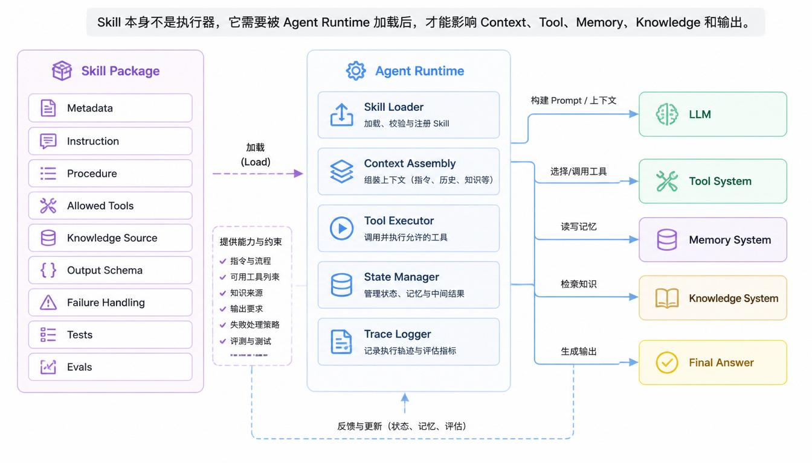

# Chapter 8 - Capability Packaging System: How Skills Reuse Agent Capabilities

*From "it can run" to "it can be reused, loaded, and managed"*

As an Agent grows, it accumulates prompts, procedures, tools, retrieval rules, output schemas, examples, and evaluation criteria. If everything is placed into one large prompt or one giant runtime, the system becomes hard to maintain.

The Skill System solves this by packaging reusable capabilities.

## 8.1 Why Agents Need Skills: From Runnable to Reusable

A minimal Agent can run with a few functions and prompts. But real systems need reusable task capability:

- Report writing.
- Code review.
- Data analysis.
- Customer support.
- Contract review.
- Knowledge retrieval.
- Spreadsheet analysis.

Each capability may need different instructions, tools, knowledge sources, output formats, and permissions. A Skill packages these together so the Agent can load the right capability for the task.

## 8.2 What Is a Skill: A Reusable Capability Unit

A Skill is a reusable capability unit that can be registered, selected, loaded, executed, and evaluated.

It is not merely a longer prompt. A useful Skill may contain:

- Metadata.
- Trigger conditions.
- Instructions.
- Procedures.
- Allowed tools.
- Knowledge sources.
- Output schema.
- Failure handling.
- Tests or evaluation criteria.

The runtime uses Skill metadata to decide whether the Skill is relevant. It loads full Skill details only when needed.

## 8.3 Three Engineering Problems Skills Solve

Skills solve three major engineering problems.

**First, organization.** As capabilities grow, the system needs a way to organize instructions, tools, and procedures by task type.

**Second, reuse.** A well-designed Skill can be used across many tasks without rewriting prompts every time.

**Third, control.** A Skill can restrict tools, define output format, and set task-specific boundaries.

| Problem | Without Skill | With Skill |
| --- | --- | --- |
| Organization | One giant prompt or scattered code | Capability packages |
| Reuse | Copy and paste instructions | Register and invoke Skill |
| Control | All tools and rules mixed together | Skill-specific tools and boundaries |

## 8.4 Why Skills Need Progressive Loading

Progressive Loading means the system does not load every Skill in full at the start. It first loads lightweight metadata, selects the relevant Skill, then loads the full package.

This matters because full Skills may include long instructions, procedures, schemas, examples, and tool policies. Loading all of them into Context would:

- Waste tokens.
- Confuse the model.
- Increase prompt injection surface.
- Mix unrelated task rules.
- Make debugging harder.

> **Key Understanding**
>
> The value of a Skill System is not making the prompt longer. It is letting the runtime know which capability to load, when, and with what boundaries.



## 8.5 Progressive Loading Flow: From Registry to Execution

A minimal flow:

```text
User Input
  -> Extract Goal
  -> Load Skill Registry metadata
  -> Select Skill
  -> Load selected Skill Package
  -> Retrieve relevant Memory and Knowledge
  -> Expose allowed Tools
  -> Assemble Context
  -> Execute Agent loop
```

The Skill Registry contains lightweight information:

```json
{
  "id": "ev_market_analysis",
  "name": "New-energy vehicle market analysis",
  "description": "Analyze sales, pricing, policy, and battery cost changes.",
  "triggers": ["new-energy vehicle", "industry analysis", "sales changes"],
  "version": "1.0.0"
}
```

The full Skill Package is loaded only after selection.

## 8.6 How Skills Are Usually Built in Formal Projects

In a formal project, a Skill is often stored as a directory or package:

```text
skills/
  ev_market_analysis/
    skill.json
    instructions.md
    procedure.md
    output_schema.json
    examples/
    evals/
```

The exact layout depends on the framework. The important idea is that Skill content is versioned, testable, and separate from the global Agent runtime.

## 8.7 Relationship Between Skill Package and Agent Runtime

The Skill does not execute itself. The Agent Runtime executes.

The Skill tells the runtime:

- What task it supports.
- What instructions to apply.
- What tools are allowed.
- What knowledge sources are relevant.
- What output structure is expected.
- What to do when failure occurs.

The runtime handles:

- Loading the Skill.
- Calling the LLM.
- Executing tools.
- Maintaining State.
- Enforcing permissions.
- Recording Trace.

## 8.8 Minimal Components of a Formal Skill

A minimal Skill may contain:

| Component | Purpose |
| --- | --- |
| Metadata | Identify and select the Skill |
| Trigger rules | Decide when the Skill is relevant |
| Instruction | Define model behavior |
| Procedure | Define task steps or reasoning path |
| Allowed tools | Restrict execution capabilities |
| Knowledge sources | Point to relevant retrieval sources |
| Output schema | Make output predictable |
| Failure handling | Define when to retry, ask, or stop |
| Evaluation | Test whether the Skill works |

Not every Skill needs all components at first. Start small, then add structure where it improves reliability.

## 8.9 How Skill Connects Tool, Memory, Knowledge, and Context

A Skill sits above several Agent subsystems.

- Tool System: the Skill can allow only certain tools.
- Memory System: the Skill can define which memory scopes matter.
- Knowledge System: the Skill can point to relevant knowledge bases.
- Context Assembly: the Skill contributes instructions, procedures, output schemas, and retrieved material.

Example:

```json
{
  "skill_id": "ev_market_analysis",
  "allowed_tools": ["retrieve_market_knowledge"],
  "memory_scope": "industry_analysis",
  "knowledge_sources": ["market_reports", "policy_updates"],
  "output_schema": ["conclusion", "evidence", "risks", "recommendations"]
}
```

The Skill does not replace these systems. It organizes how they are used for one class of tasks.

## 8.10 Common Mistakes in Skill Design

Common mistakes include:

- Treating Skill as only a long prompt.
- Loading all Skills into Context at once.
- Allowing every Skill to use every Tool.
- Hiding permissions inside model instructions instead of runtime checks.
- Creating Skills that overlap heavily and confuse selection.
- Failing to version or test Skills.
- Storing raw knowledge inside the Skill instead of using a Knowledge System.

Good Skills are focused, explicit, testable, and bounded.

## 8.12 Chapter Summary: Skill Is the Capability Organization Layer for Complex Agents

Skill System helps Agents move from "can run once" to "can reuse capabilities reliably."

A Skill is:

- A reusable capability package.
- Selected through metadata.
- Loaded progressively.
- Connected to tools, memory, knowledge, and context.
- Executed by the Agent runtime.
- Controlled by permissions and output schemas.
- Improved through tests and evaluation.

As Agent systems become larger, Skills become the layer that keeps capabilities organized and manageable.
